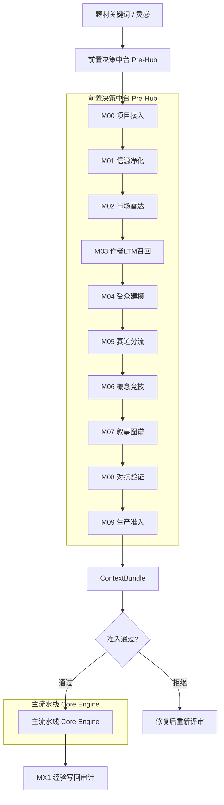

# 🐉 红果剧本一键制造机 V4.1 (Pre-Hub V4)

[](https://www.python.org/downloads/)
[](https://opensource.org/licenses/MIT)
[](https://help.aliyun.com/zh/dashscope/)

> **愿每一部剧本都能成为千万级爆款。**

**红果剧本一键制造机** 是一款专为短剧从业者设计的工业级自动化生产工具。它采用**前置决策中台 Pre-Hub V4 + 主流水线 Core Engine** 的双层架构：Pre-Hub 负责市场证据、作者 LTM、赛道分流、对抗验证与准入护照，Core Engine 负责草稿解析、渲染、质检和投稿打包。所有密钥只从本地环境变量读取，严禁写入代码或配置文件。

---

## 🏗️ 双层架构 (Dual-Layer Architecture)



### 前置决策中台 (Pre-Hub V4) - M00-M09 + MX1

| 模块 | 名称 | 职责 |
|:---:|:---|:---|
| **M00** | 项目接入 | 题材、形态、作者、硬约束规范化 |
| **M01** | 信源净化 | 时效校验、信源分级、事实/观点分桶、风险抽取 |
| **M02** | 市场雷达 | 赛道热力、形态适配、创新窗口、风险热区 |
| **M03** | 作者LTM | SearchMemory 召回作者经验，生成偏差校准包 |
| **M04** | 受众建模 | 免疫区/疲惫区/高敏区/可整合惊讶带分析 |
| **M05** | 赛道分流 | 内容赛道 + 制作形态双维路由 |
| **M06** | 概念竞技 | 候选方案评分，选 winner / runner-up / kill |
| **M07** | 叙事图谱 | GoT节点、情绪债、钩子链、写作简报 |
| **M08** | 对抗验证 | 证据、路线、钩子、合规、制作负担十项检查 |
| **M09** | 生产准入 | 颁发准入护照，生成 ContextBundle |
| **MX1** | LTM治理 | 写回候选、去重、审计、AddMemory/UpdateMemory |

### 主流水线 (Core Engine)

| 模块 | 职责 |
|:---|:---|
| **Parser** | LLM智能解析，草稿 → 结构化JSON |
| **Renderer** | 格式渲染，JSON → 工业排版剧本 |
| **Validator** | 商业质检，12项健康指标校验 |
| **Session Cache** | Token消耗降低最高40% |
| **AIMD Limiter** | 自动规避429限流 |

---

## 🚀 核心优势 (Core Advantages)

### 1. 🧠 智能立项决策
- **M00-M09 前置工作流**：在真正写作前完成市场验证、赛道判断、概念竞技
- **贝叶斯自由能量尺**：量化"新鲜度-困惑度-可整合度"，确保创新与可读性平衡
- **ToT方案竞技**：并行生成3-5个候选方案，优选后再进入生产
- **真实源可降级**：优先 Tavily / 百炼 / LTM，缺 key 或失败时降级本地知识库并写入 `fallback_reasons`

### 2. ⚡ 极限性能与成本控制 (Performance)
- **Session Cache 深度集成**：适配 DashScope 最新 Responses API，Token消耗最高降低 **40%**
- **AIMD 智能降频**：内置工业级 AIMD 并发控制算法，彻底杜绝 `429 Too Many Requests`

### 3. 🧪 神经科学级质量控制 (QA)
- **12项剧本健康指标**：黄金前三集钩子、双线冲突密度、单集反转点、付费点卡位等
- **对抗验证层**：主动识别套路换皮、伪创新、角色降智等致命问题

---

## 🕹️ 使用方式 (Usage)

### 方式一：完整流程（推荐）

```bash
# Step 1: 前置评审 - 立项决策
python -m scripts.preflight "都市复仇" --format real --author author_001 --save-bundle reports/preflight

# Step 2: 主流水线 - 携带 ContextBundle 生产
python -m scripts.cli run --bundle reports/preflight/bundle_<project_id>.json
```

### 方式二：一键全流程

```bash
# 启动器中选择 [9]，或命令行分两步执行上方完整流程
启动器.bat
```

### 方式三：直接生产（快速迭代）

```bash
# 跳过 Pre-Hub，仅处理 drafts/
python -m scripts.cli run --no-cache
```

### LTM 写回审计

```bash
# 查看本地写回候选
python -m scripts.cli ltm-review

# 将已批准候选写回云端 LTM
python -m scripts.cli ltm-review --project-id prj_xxx --apply-approved
```

### preflight 命令参数

| 参数 | 说明 | 示例 |
|:---|:---|:---|
| `topic` | 项目题材/关键词（必需） | `"都市复仇"` |
| `--format`, `-f` | 制作形态 | `real` / `ai` / `mixed` |
| `--author` | 作者ID | `my_id` |
| `--no-rag` | 禁用RAG增强 | - |
| `--output`, `-o` | 保存报告文件 | `./report.md` |
| `--save-bundle` | 保存ContextBundle | `./bundles/` |

报告默认写入：

- `reports/preflight/*.json`
- `reports/preflight/*.md`
- `reports/ltm_audit/ltm_audit.jsonl`

---

## 📂 目录结构 (Architecture)

```text
.
├── core_engine/          # 主流生产引擎
│   ├── parser.py         # LLM解析器
│   ├── renderer.py       # 格式渲染器
│   ├── validator.py      # 商业质检器
│   ├── batch_processor.py # 批处理器
│   ├── main_pipeline.py  # 流水线入口
│   └── ...
├── pre_hub/              # [新增] 前置决策中台
│   ├── pre_hub.py        # M00-M09 协调器
│   ├── ltm.py            # LTM 召回/写回/审计
│   ├── layer0_source_guard/  # 信源净化
│   ├── schemas/
│   │   └── pre_hub_models.py # Pydantic v2 数据模型
│   └── ...
├── rag_engine/           # RAG混合检索引擎
│   ├── retriever.py      # 混合检索器
│   ├── tavily_search.py  # Tavily联网搜索
│   └── bailian_retriever.py # 阿里云百炼向量库
├── scripts/              # CLI命令行入口
│   ├── cli.py           # 主流水线CLI
│   └── preflight.py      # 前置评审CLI
├── drafts/               # [输入] 原始灵感草稿
├── scripts_output/       # [输出] 成品剧本
├── reports/              # [输出] 质量诊断报告
│   ├── preflight/        # Pre-Hub 准入报告与 Bundle
│   └── ltm_audit/        # LTM 写回审计镜像
├── knowledge_base/       # RAG知识库存储
├── templates/            # 剧本模板与灵感卡片
├── config.yaml           # 全局工业配置
└── 启动器.bat            # 一键式管理控制入口
```

---

## 🛠️ 快速开始 (Quick Start)

### 1. 环境初始化
```bash
# 克隆项目后，推荐使用 Python 3.11+
python -m pip install -e .
```

### 2. 配置环境变量
密钥只能设置在本地环境变量中，不要写入任何代码文件或 `config.yaml`。

```powershell
$env:DASHSCOPE_API_KEY="..."
$env:TAVILY_API_KEY="..."
$env:WORKSPACE_ID="..."
$env:BAILIAN_INDEX_ID="..."
$env:LTM_MEMORY_LIBRARY_ID="..."
$env:LTM_PROFILE_SCHEMA_ID="..."
```

`DASHSCOPE_API_KEY` 用于 LLM 与 LTM；`TAVILY_API_KEY` 用于实时市场源；`WORKSPACE_ID` / `BAILIAN_INDEX_ID` 用于百炼 RAG；`LTM_*` 用于作者长期记忆。缺少可选 key 时系统会降级本地知识库，并在报告里写明 fallback。

### 3. 启动项目

**方式一**：双击 `启动器.bat`，按编号选择功能

**方式二**：命令行

```bash
# 前置评审
python -m scripts.preflight "战神" --format real --save-bundle reports/preflight

# 主流生产
python -m scripts.cli run --bundle reports/preflight/bundle_<project_id>.json
```

---

## 📊 准入护照示例

```
============================================================
[PREFLIGHT PASSPORT]
============================================================
项目ID: prj_xxx
项目标题: 都市复仇
准入状态: [PASS] 通过
总分: 76/100
决策: pass
过期时间: 2026-05-25 23:49

各关卡得分:
  信源净化: ######---- 62
  市场雷达: #######--- 76
  作者记忆: #####----- 58
  赛道分流: #######--- 73
  概念竞技: #######--- 74
  叙事图谱: ########-- 82
  对抗验证: ########-- 80

============================================================
[SUCCESS] 项目通过准入，可以使用 ContextBundle 继续主流水线！
```

---

## 🛡️ 维护与日志

- **实时日志**：详见 `logs/`，采用结构化 JSON 记录，方便回溯生成逻辑
- **快照恢复**：系统每一步处理都会生成快照，若遇断电或中断，可从 `.cache/` 自动恢复任务
- **准入护照**：有效期14天，过期需重新评审
- **Fallback审计**：所有云端缺失或失败都会进入 `fallback_reasons`
- **LTM审计**：写回候选先进入 `reports/ltm_audit/ltm_audit.jsonl`，再由 `ltm-review --apply-approved` 写回云端

---

## 🔮 技术栈

| 组件 | 技术 |
|:---|:---|
| LLM | 阿里云 DashScope (Qwen3.6-plus) |
| 检索 | 阿里云百炼向量库 + Tavily实时搜索 + 本地知识库降级 |
| LTM | 阿里云长期记忆 API + 本地审计镜像 |
| 缓存 | Session Cache (Token节省40%) |
| 限流 | AIMD自适应算法 |
| 数据模型 | Pydantic v2 |

---

*Developed with ❤️ for Script Writers.*
