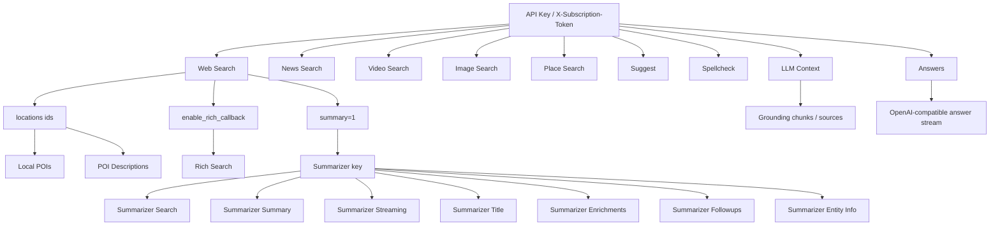
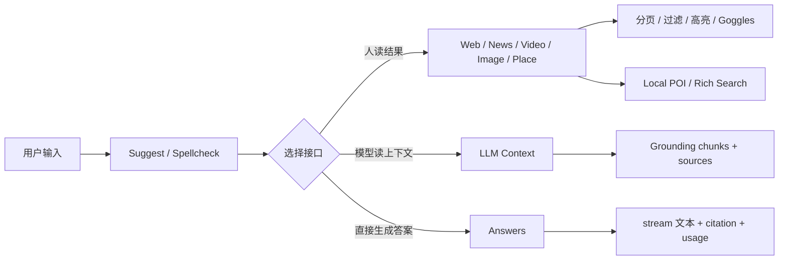

# Brave Search API 中文详细攻略

## 执行摘要

这次研究优先走了你指定的路径：先看连接器，再看官方站。连接器侧，Google Drive 中检索到一份 **Brave Search MCP Server** 的 README，内容能帮助快速确认 Brave 现有的搜索能力面：Web、Local、Image、Video、News、Summarizer 等；但它更像生态侧集成资料，不是权威 API 规范，所以后续事实判断仍以 `brave.com/search/api` 和 `api-dashboard.search.brave.com` 的官方文档与 API Reference 为准。 fileciteturn2file0L1-L1 citeturn15search2turn8view0

截至 2026 年 5 月，这套 API 的**当前主线**可以压缩成四类：一类是 **Search plan** 下的检索接口，覆盖 Web、News、Video、Image、Place、Local POI、Rich Search 与 LLM Context；二类是 **Answers API**，走 OpenAI 兼容的 `chat/completions` 路线；三类是 **Autosuggest / Spellcheck**；四类是**遗留但仍有文档**的 Summarizer Search，它已被官方标记为 deprecated，推荐新项目优先用 Answers。认证方式统一为 `X-Subscription-Token` 请求头，版本控制靠 URL 里的 `v1` 与可选的 `Api-Version: YYYY-MM-DD` 头；速率限制通过一组 `X-RateLimit-*` 头返回。Search 计划当前文档显示容量 50 req/s，Answers 默认 2 req/s，Autosuggest 与 Spellcheck 各自 100 req/s。 citeturn2view0turn10view0turn2view1turn4search7turn25view0turn28search1

结论前置地说，如果你是做**普通搜索集成**，主接口还是 `web/search`；如果你是做**Agent、RAG、实时 grounding**，优先用 `llm/context`；如果你要做**聊天式最终答案输出**，优先 `chat/completions`；如果你要做**地点检索**，新接口优先 `local/place_search`，老方式是 Web Search 先拿 location id，再打 `local/pois` 与 `local/descriptions`。Summarizer 值得了解，但不建议当成新项目主轴。 citeturn8view0turn24view0turn23view0turn14view0turn14view1turn28search1turn25view0

## 研究范围与优先来源

本报告覆盖你要求的这些维度：API 概览、认证与密钥管理、速率限制、端点清单、请求/响应示例、错误处理与状态码、分页与过滤、典型用例、最佳实践、安全注意事项、版本与变更日志、常见问题与排错步骤。核心信息优先来自两个官方站点：`brave.com/search/api` 与 `api-dashboard.search.brave.com`；后者又拆成 Documentation、API Reference、Pricing、Security、Privacy、Terms、Status Updates 等页面。 citeturn0search3turn15search2turn8view0turn15search0turn4search7turn15search1turn15search5turn4search2turn4search0

我实际使用的优先级是这样的。先从 Google Drive / Gmail 连接器里找用户相关材料，再回到官方站核实。Drive 中命中的 Brave Search MCP Server README 对功能面有帮助，但它本质上是基于 Brave API 的上层工具说明；官方 dashboard 的文档和 API Reference 才是端点、参数、状态码与计划能力的准绳。 fileciteturn6file0L1-L1 citeturn8view0turn24view0turn25view0

需要特别说明的一点是：Brave 的文档体系现在有**新旧并存**。你会同时看到 “Answers / LLM Context / Place Search” 这样的新主线，也会看到旧的 “Summarizer / AI Grounding” 命名痕迹。官方当前对外主推的是 Answers 和 LLM Context；Summarizer 仍在文档中，但已经标记为 deprecated。 citeturn5search1turn24view0turn23view0turn28search1

## 快速上手与总体架构

Quickstart 的基本流程很直白：注册账号、订阅计划、在 dashboard 创建 API key、通过 `X-Subscription-Token` 带上密钥发第一条请求。官方 Quickstart 给出的第一条请求就是 `web/search?q=artificial+intelligence`。认证文档进一步强调，密钥不能放在前端、公开仓库或公开位置，建议用环境变量保存，并定期轮换；如果怀疑泄露，要立刻在 dashboard 吊销并重建。 citeturn15search0turn2view0

当前计划与容量，最实用的理解方式如下。这个表的价格、容量和功能范围以 dashboard 当前定价页与官方营销页为主。 citeturn4search7turn0search3

| 计划 | 核心用途 | 典型 API | 计费方式 | 当前容量 |
|---|---|---|---|---|
| Search | 实时搜索与 grounding 原材料 | `web/search`、`news/search`、`videos/search`、`images/search`、`local/place_search`、`local/pois`、`local/descriptions`、`web/rich`、`llm/context` | `$5 / 1000 requests`，含每月 `$5` credits | `50 requests/s` |
| Answers | 直接给出带来源的 AI 答案 | `chat/completions` | `$4 / 1000 queries` + 输入/输出 token 费用 | `2 requests/s` |
| Autosuggest | 输入联想 | `suggest/search` | `$5 / 10000 requests` | `100 requests/s` |
| Spellcheck | 拼写纠错 | `spellcheck/search` | `$5 / 10000 requests` | `100 requests/s` |

认证方式其实不复杂，但有几个“别踩坑”的点。 `X-Subscription-Token` 是必需认证头；`Api-Version` 是可选但推荐在生产环境固定的版本头；`Cache-Control: no-cache` 是请求新鲜结果时的 best-effort 选项；很多搜索接口还支持一组 `x-loc-*` 头或地理参数，用来增强本地化结果。 citeturn2view0turn10view0turn8view0turn24view0

| 项目 | 用法 | 是否必需 | 说明 |
|---|---|---|---|
| 认证头 | `X-Subscription-Token: YOUR_API_KEY` | 必需 | 所有 Brave Search API 请求都要带 |
| 版本头 | `Api-Version: 2023-01-01` | 可选但推荐 | 不带时默认使用最新版本 |
| URL 版本 | `/res/v1/...` | 必需 | 大版本，通常变化少 |
| JSON 接受头 | `Accept: application/json` | 推荐 | 官方示例默认这样写 |
| Gzip | `Accept-Encoding: gzip` | 推荐 | 官方示例默认开启 |
| 刷新缓存 | `Cache-Control: no-cache` | 可选 | best-effort，不保证绝对绕过缓存 |

速率限制返回的头值得你在客户端直接接管，因为 Brave 是按**1 秒滑动窗口**做计数的。你至少要读四个头：`X-RateLimit-Limit`、`X-RateLimit-Policy`、`X-RateLimit-Remaining`、`X-RateLimit-Reset`。达到限制时会返回 `429`。官方还特别说明：**只有成功请求会计入 quota 并计费**。 citeturn2view1

| 头 | 含义 | 示例 |
|---|---|---|
| `X-RateLimit-Limit` | 当前计划的窗口上限 | `1, 15000` |
| `X-RateLimit-Policy` | 每个窗口及秒数 | `1;w=1, 15000;w=2592000` |
| `X-RateLimit-Remaining` | 各窗口剩余额度 | `1, 1000` |
| `X-RateLimit-Reset` | 距离各窗口重置还有几秒 | `1, 1419704` |

下面这张关系图，把整个 API 面压成一个能落地的 mental model。图里的箭头代表“你最常见的调用顺序”，不是协议层面的强依赖。依据官方端点总览、LLM Context、Answers、Place Search 与 Summarizer 文档整理。 citeturn8view0turn24view0turn25view0turn23view0turn28search1



典型请求流可以这样理解。图里把“用户输入 → 预处理 → 实际检索 → 后处理”拆开了。这个流程对 Web、News、Video、Image 都成立，对 Answers 则是“检索 + 生成”耦合版。 citeturn19view2turn19view3turn8view0turn22view0turn21view0turn25view0



为了避免后面每个端点示例都重复造轮子，我先给一套最小可复用 helper。它只封装了官方 base URL、认证头和 GET/POST 两种调用。 citeturn2view0turn8view0turn26view0turn24view0turn25view0

```python
# Python helper
import os
import requests

BASE = "https://api.search.brave.com/res/v1"
HEADERS = {
    "Accept": "application/json",
    "Accept-Encoding": "gzip",
    "X-Subscription-Token": os.environ["BRAVE_API_KEY"],
}

def brave_get(path: str, params: dict | list | None = None):
    return requests.get(f"{BASE}{path}", headers=HEADERS, params=params, timeout=30)

def brave_post(path: str, body: dict):
    headers = {**HEADERS, "Content-Type": "application/json"}
    return requests.post(f"{BASE}{path}", headers=headers, json=body, timeout=30)
```

```javascript
// Node.js helper
const BASE = "https://api.search.brave.com/res/v1";
const HEADERS = {
  "Accept": "application/json",
  "Accept-Encoding": "gzip",
  "X-Subscription-Token": process.env.BRAVE_API_KEY,
};

export async function braveGet(path, params = {}) {
  const url = new URL(`${BASE}${path}`);
  for (const [k, v] of Object.entries(params)) {
    if (Array.isArray(v)) v.forEach(x => url.searchParams.append(k, x));
    else if (v !== undefined && v !== null) url.searchParams.set(k, String(v));
  }
  const res = await fetch(url, { headers: HEADERS });
  return res.json();
}

export async function bravePost(path, body) {
  const res = await fetch(`${BASE}${path}`, {
    method: "POST",
    headers: { ...HEADERS, "Content-Type": "application/json" },
    body: JSON.stringify(body),
  });
  return res.json();
}
```

## 端点总览与选择原则

先把接口盘清楚。下面这张表，是我按“你写系统时怎么选”来整理的，而不是按网站左边菜单顺序机械抄。端点清单来自 API Reference 总览、各接口 reference 页，以及 Summarizer 文档中的遗留端点列表。 citeturn8view0turn24view0turn23view0turn19view0turn21view0turn19view1turn25view0turn19view2turn19view3turn28search1

| 分组 | 方法与 URL | 何时用 | 关键点 |
|---|---|---|---|
| Web Search | `GET/POST https://api.search.brave.com/res/v1/web/search` | 通用网页检索、人类可读结果页 | 支持 `result_filter`、`text_decorations`、`goggles`、`summary`、`enable_rich_callback` |
| Rich Search | `GET https://api.search.brave.com/res/v1/web/rich` | Weather、stock、calculator 等实时富结果 | 先在 Web Search 打 `enable_rich_callback=true` 拿 `callback_key` |
| Local POIs | `GET https://api.search.brave.com/res/v1/local/pois` | 通过 location id 拉详情 | `ids` 只保活约 8 小时 |
| POI Descriptions | `GET https://api.search.brave.com/res/v1/local/descriptions` | 拉 AI 生成地点简介 | 同样依赖短期有效的 `ids` |
| LLM Context | `GET/POST https://api.search.brave.com/res/v1/llm/context` | Agent / RAG / grounding | 直接返回适合模型消费的 chunks、tables、code 等上下文 |
| Place Search | `GET https://api.search.brave.com/res/v1/local/place_search` | 地理地点检索 | 新主线，本地探索优先它 |
| News Search | `GET/POST https://api.search.brave.com/res/v1/news/search` | 新闻检索 | 支持 freshness、extra_snippets、goggles |
| Video Search | `GET/POST https://api.search.brave.com/res/v1/videos/search` | 视频检索 | 支持 freshness、operators |
| Image Search | `GET https://api.search.brave.com/res/v1/images/search` | 图片检索 | 默认 `strict`，最多 `200` 条 |
| Answers | `POST https://api.search.brave.com/res/v1/chat/completions` | 直接生成 grounded answer | OpenAI SDK compatible，支持 stream 与 research mode |
| Suggest | `GET https://api.search.brave.com/res/v1/suggest/search` | 输入联想 | 可选 `rich=true` |
| Spellcheck | `GET https://api.search.brave.com/res/v1/spellcheck/search` | 拼写纠错 | 适合 search box 前置修正 |
| Legacy Summarizer | `GET https://api.search.brave.com/res/v1/summarizer/*` | 老流程总结与增强 | 已 deprecated，新项目优先 Answers |

如果你不想记这么多，只记四条选择规则就够了。第一，**用户自己看结果**，先 `web/search`。第二，**模型自己吃上下文**，先 `llm/context`。第三，**你要最终答案而不是候选结果**，用 `chat/completions`。第四，**地点就是地点，不要硬拿 Web Search 兜**，优先 `local/place_search`；只有在你已经从 Web Search 拿到了 location id，才接 `local/pois` 和 `local/descriptions`。 citeturn8view0turn24view0turn25view0turn23view0turn14view0turn14view1

## 端点详解与示例

### Web Search

**功能说明**  
这是主入口。它返回的不是单一 `results`，而是一个组合响应：`web`、`news`、`videos`、`locations`、`infobox`、`faq`、`discussions`、`summarizer`、`rich` 等字段都可能出现。它适合做搜索页、搜索代理、搜索中台，也适合作为 Rich Search、Local POIs、Summarizer 的上游。 `count` 只作用于 `web` 结果，`offset` 最大 9，`result_filter` 可以限制返回类型。 `text_decorations=true` 时，描述文本会带高亮装饰；`summary=true` 会生成 Summarizer 所需 key；`enable_rich_callback=true` 能让你后续用 `callback_key` 拉 `web/rich`。分页上官方建议不要盲翻页，而是看 `query.more_results_available`。 citeturn8view0turn9view0turn18search1

**方法与 URL**  
`GET https://api.search.brave.com/res/v1/web/search`  
`POST https://api.search.brave.com/res/v1/web/search` citeturn8view0turn26view0

**必需参数**  
`q`。 citeturn8view0turn26view0

**高频可选参数**  
`country`、`search_lang`、`ui_lang`、`count<=20`、`offset<=9`、`safesearch`、`spellcheck`、`freshness`、`text_decorations`、`result_filter`、`units`、`goggles`、`extra_snippets`、`summary`、`enable_rich_callback`、`include_fetch_metadata`、`operators`，以及一组 `x-loc-*` 本地化 header。 citeturn8view0turn26view0

```bash
curl "https://api.search.brave.com/res/v1/web/search?q=rust+filetype:pdf&count=10&text_decorations=true&result_filter=web,news" \
  -H "Accept: application/json" \
  -H "Accept-Encoding: gzip" \
  -H "X-Subscription-Token: $BRAVE_API_KEY"
```

```json
{
  "type": "search",
  "query": {
    "original": "rust filetype:pdf",
    "more_results_available": true
  },
  "web": {
    "results": [
      {
        "title": "The Rust Programming Language",
        "url": "https://doc.rust-lang.org/book/",
        "description": "Official Rust book..."
      }
    ]
  },
  "news": {
    "results": []
  }
}
```

```python
data = brave_get(
    "/web/search",
    {
        "q": "rust filetype:pdf",
        "count": 10,
        "text_decorations": True,
        "result_filter": "web,news",
    },
).json()
print(data["type"], data["query"]["original"])
```

```javascript
const data = await braveGet("/web/search", {
  q: "rust filetype:pdf",
  count: 10,
  text_decorations: true,
  result_filter: "web,news",
});
console.log(data.type, data.query.original);
```

```bash
curl -X POST "https://api.search.brave.com/res/v1/web/search" \
  -H "Content-Type: application/json" \
  -H "X-Subscription-Token: $BRAVE_API_KEY" \
  -d '{
    "q": "best startups in tokyo",
    "country": "JP",
    "search_lang": "ja",
    "count": 10,
    "result_filter": ["web","locations"]
  }'
```

**常见错误与解决方案**  
`422` 常见于参数非法，比如 `count`、`offset`、枚举值不合法；`429` 是速率限制；`404` 一般说明路径或资源不匹配。生产环境里，Web Search 最容易犯的两个错是把 `offset` 当作“跳过的条数”而不是“第几页”，以及忘了 `count` 只控制 `web` 结果，不控制整个 mixed 响应。 citeturn9view0turn2view1turn8view0

### Rich Search

**功能说明**  
这是 Web Search 的富结果后取接口，目标是天气、汇率、股票、计算器、包裹、体育等实时结构化结果。你不能直接盲打它，必须先在 Web Search 里设置 `enable_rich_callback=true`，拿到 `callback_key` 再拉富结果。 citeturn19view4turn18search1

**方法与 URL**  
`GET https://api.search.brave.com/res/v1/web/rich` citeturn19view4

**必需参数**  
`callback_key`。 citeturn19view4

```bash
curl "https://api.search.brave.com/res/v1/web/rich?callback_key=1234567890" \
  -H "Accept: application/json" \
  -H "Accept-Encoding: gzip" \
  -H "X-Subscription-Token: $BRAVE_API_KEY"
```

```json
{
  "type": "rich",
  "results": [
    {
      "type": "rich",
      "subtype": "weather"
    }
  ]
}
```

```python
data = brave_get("/web/rich", {"callback_key": "1234567890"}).json()
print(data["type"])
```

```javascript
const data = await braveGet("/web/rich", { callback_key: "1234567890" });
console.log(data.type);
```

**常见错误与解决方案**  
如果没先走 Web Search 或 `callback_key` 过期，最容易拿到 `404` 或 `422`。这个接口本质上是 callback retrieval，不是独立搜索入口。 citeturn19view4turn20view3

### Local POIs 与 POI Descriptions

**功能说明**  
这两个接口是旧本地化流的详情补全层。你先通过 Web Search 或 Place Search 拿到 location `id`，再用 `local/pois` 拉 POI 详细资料，再用 `local/descriptions` 拉 AI 生成的简介。官方明确说 `ids` 只在约 8 小时内有效，不要持久化。 Place Search 与 Web Search 拿到的 id 可以通用。 citeturn14view0turn14view1turn7search1

**方法与 URL**  
`GET https://api.search.brave.com/res/v1/local/pois`  
`GET https://api.search.brave.com/res/v1/local/descriptions` citeturn14view0turn14view1

**必需参数**  
都需要 `ids`；`local/pois` 还常配 `search_lang`、`ui_lang`、`units`。 citeturn14view0turn14view1

```bash
curl "https://api.search.brave.com/res/v1/local/pois?ids=loc4FNMQJNOOCVHEB7UBOLN354ZYIDIYJ3RPRETERRY%3D" \
  -H "Accept: application/json" \
  -H "Accept-Encoding: gzip" \
  -H "X-Subscription-Token: $BRAVE_API_KEY"

curl "https://api.search.brave.com/res/v1/local/descriptions?ids=loc4FNMQJNOOCVHEB7UBOLN354ZYIDIYJ3RPRETERRY%3D" \
  -H "Accept: application/json" \
  -H "Accept-Encoding: gzip" \
  -H "X-Subscription-Token: $BRAVE_API_KEY"
```

```json
{
  "type": "local_pois",
  "results": [
    {
      "id": "loc4FNMQJNOOCVHEB7UBOLN354ZYIDIYJ3RPRETERRY=",
      "title": "Blue Bottle Coffee"
    }
  ]
}
```

```json
{
  "type": "local_descriptions",
  "results": [
    {
      "id": "loc4FNMQJNOOCVHEB7UBOLN354ZYIDIYJ3RPRETERRY=",
      "description": "A popular specialty coffee shop..."
    }
  ]
}
```

```python
pois = brave_get("/local/pois", {"ids": poi_id}).json()
desc = brave_get("/local/descriptions", {"ids": poi_id}).json()
print(pois["type"], desc["type"])
```

```javascript
const pois = await braveGet("/local/pois", { ids: poiId });
const desc = await braveGet("/local/descriptions", { ids: poiId });
console.log(pois.type, desc.type);
```

**常见错误与解决方案**  
`400/422` 多半是 `ids` 格式或数量问题；`404` 常见于 id 已失效；`429` 按常规退避处理。真正的工程要点不是“怎么调”，而是**不要存旧 id**。 id 设计就是短生存期。 citeturn14view0turn20view4turn2view1

### LLM Context

**功能说明**  
如果你的消费方是模型，而不是人，这个接口往往比 Web Search 更对路。它会返回适合 LLM 消费的 grounding 容器与 sources 元数据，支持 tokens、snippet 数量、每 URL token 上限、阈值模式、Goggles、本地召回与 freshness 控制。它既有 GET，也有 POST；POST 特别适合参数太多、URL 太长时。 citeturn24view0turn11view1turn11view2turn27view2

**方法与 URL**  
`GET https://api.search.brave.com/res/v1/llm/context`  
`POST https://api.search.brave.com/res/v1/llm/context` citeturn24view0turn27view2

**必需参数**  
`q`。 citeturn24view0turn27view2

**高频可选参数**  
`count<=50`、`maximum_number_of_urls`、`maximum_number_of_tokens`、`maximum_number_of_snippets`、`maximum_number_of_tokens_per_url`、`maximum_number_of_snippets_per_url`、`context_threshold_mode`、`enable_local`、`enable_source_metadata`、`goggles`、`freshness`，以及本地化 `x-loc-*` 头。官方给的默认建议也很实用：简单事实型任务可缩到 `max_tokens=2048`，复杂研究型可以把上下文预算加到 `16384`。 citeturn24view0turn11view1turn11view2

```bash
curl -X GET "https://api.search.brave.com/res/v1/llm/context?q=tallest+mountains+in+the+world&maximum_number_of_tokens=4096&context_threshold_mode=balanced" \
  -H "X-Subscription-Token: $BRAVE_API_KEY"

curl -X POST "https://api.search.brave.com/res/v1/llm/context" \
  -H "Content-Type: application/json" \
  -H "X-Subscription-Token: $BRAVE_API_KEY" \
  -d '{
    "q": "Compare AI frameworks for production",
    "maximum_number_of_tokens": 16384,
    "maximum_number_of_urls": 20,
    "context_threshold_mode": "balanced"
  }'
```

```json
{
  "grounding": {
    "text": [],
    "tables": [],
    "code": []
  },
  "sources": {
    "https://example.com": {
      "site_name": "Example"
    }
  }
}
```

```python
data = brave_get("/llm/context", {
    "q": "best practices for react hooks",
    "maximum_number_of_tokens": 4096,
    "context_threshold_mode": "balanced",
}).json()
print(data.keys())
```

```javascript
const data = await bravePost("/llm/context", {
  q: "best practices for react hooks",
  maximum_number_of_tokens: 4096,
  context_threshold_mode: "balanced",
});
console.log(Object.keys(data));
```

**常见错误与解决方案**  
`403` 在这里特别需要注意，通常意味着订阅能力不匹配；`422` 常见于 token/snippet 参数越界；`429` 是限速。这里最容易犯的不是技术错误，而是方法错误：对简单事实问题给过大上下文预算，结果把你下游推理成本白白拉高。 citeturn24view0turn2view1turn11view1

### Place Search

**功能说明**  
这是当前地点检索的主接口。它不是“网页里带地点”的搜索，而是直接检索物理世界里的地点。支持坐标或 `location` 文本锚定，`q` 可省略；省略时会进入 explore mode，返回某个区域的一般性地点概览。返回不仅有 `results`，还可能给出 `cities`、`addresses`、`streets` 与 `mixed` 排序提示。Brave 目前文档写的是 **200M+ places**，而且 2026-03-04 起 radius 约束被放松，默认不再强制半径。 citeturn23view0turn17search0turn10view3

**方法与 URL**  
`GET https://api.search.brave.com/res/v1/local/place_search` citeturn23view0

**必需参数**  
严格说，没有强制 `q`，但你至少要给 `location` 或 `latitude + longitude` 中的一种，实际效果才稳定。 citeturn23view0turn17search0

**高频可选参数**  
`q`、`radius`、`count<=50`、`country`、`search_lang`、`ui_lang`、`units`、`safesearch`、`spellcheck`、`geoloc`。 citeturn23view0

```bash
curl "https://api.search.brave.com/res/v1/local/place_search?q=coffee+shops&latitude=37.7749&longitude=-122.4194&radius=1000" \
  -H "Accept: application/json" \
  -H "Accept-Encoding: gzip" \
  -H "X-Subscription-Token: $BRAVE_API_KEY"
```

```json
{
  "type": "locations",
  "query": {
    "original": "coffee shops",
    "altered": null
  },
  "results": [
    {
      "type": "location_result",
      "id": "loc4FNMQJNOOCVHEB7UBOLN354ZYIDIYJ3RPRETERRY=",
      "title": "Blue Bottle Coffee",
      "url": "https://bluebottlecoffee.com"
    }
  ],
  "mixed": [
    { "type": "results", "index": 0, "all": false }
  ],
  "location": {
    "coordinates": [37.7749, -122.4194],
    "name": "San Francisco",
    "country": "US"
  }
}
```

```python
data = brave_get("/local/place_search", {
    "q": "coffee shops",
    "latitude": 37.7749,
    "longitude": -122.4194,
    "radius": 1000,
}).json()
print(data["type"], len(data.get("results", [])))
```

```javascript
const data = await braveGet("/local/place_search", {
  q: "coffee shops",
  latitude: 37.7749,
  longitude: -122.4194,
  radius: 1000,
});
console.log(data.type, data.results?.length ?? 0);
```

**常见错误与解决方案**  
如果地点检索结果“太散”，第一看你是不是没给地理锚；第二看 `radius` 设得是不是过大；第三看 `q` 是不是通用词过于泛化。这个接口里 radius 更像“偏置”，不是严格截断半径；别把它误当 geofence。 citeturn23view0turn17search0

### News Search

**功能说明**  
专门新闻索引。它和 Web Search 最大差别不在 method，而在数据源与过滤逻辑。News Search 支持 `freshness`、`extra_snippets` 与 `goggles`，适合聚合、舆情、追踪新闻脉络。官方 changelog 里还明确写了自定义 date range、extra snippets 与 Goggles 支持的演进时间。 citeturn19view0turn22view0turn18search0

**方法与 URL**  
`GET https://api.search.brave.com/res/v1/news/search`  
`POST https://api.search.brave.com/res/v1/news/search` citeturn19view0turn27view0

**必需参数**  
`q`。 citeturn19view0turn27view0

**高频可选参数**  
`search_lang`、`ui_lang`、`country`、`safesearch`、`count<=50`、`offset<=9`、`spellcheck`、`freshness`、`extra_snippets`、`goggles`、`include_fetch_metadata`、`operators`。 citeturn22view0

```bash
curl "https://api.search.brave.com/res/v1/news/search?q=machine+learning&freshness=pm&count=10" \
  -H "Accept: application/json" \
  -H "Accept-Encoding: gzip" \
  -H "X-Subscription-Token: $BRAVE_API_KEY"
```

```json
{
  "type": "news",
  "query": { "original": "machine learning" },
  "results": [
    {
      "title": "Latest machine learning developments",
      "url": "https://example.com/news/ml"
    }
  ]
}
```

```python
data = brave_get("/news/search", {
    "q": "machine learning",
    "freshness": "pm",
    "count": 10,
}).json()
print(data["type"], len(data["results"]))
```

```javascript
const data = await braveGet("/news/search", {
  q: "machine learning",
  freshness: "pm",
  count: 10,
});
console.log(data.type, data.results.length);
```

```bash
curl -X POST "https://api.search.brave.com/res/v1/news/search" \
  -H "Content-Type: application/json" \
  -H "X-Subscription-Token: $BRAVE_API_KEY" \
  -d '{
    "q": "technology",
    "goggles": ["https://example.com/my-news-sources.goggle"],
    "count": 10
  }'
```

**常见错误与解决方案**  
`offset` 仍然是页号，不是绝对条数偏移。 `extra_snippets` 会增加上下文量，适合 AI downstream，不适合所有列表页。要做舆情源控制，优先 `goggles`，其次才是在你的应用层硬过滤。 citeturn22view0turn18search0turn16search0

### Video Search

**功能说明**  
视频接口的核心价值在于专门视频索引 + freshness。你会在教程聚合、课程发现、品牌视频监测里频繁用到它。查询参数跟 News 很像，但更突出 freshness 与 operators。官方 changelog 记了三个节点：初始资源、custom date ranges、operators 改进。 citeturn21view0turn17search2

**方法与 URL**  
`GET https://api.search.brave.com/res/v1/videos/search`  
`POST https://api.search.brave.com/res/v1/videos/search` citeturn21view0turn27view1

**必需参数**  
`q`。 citeturn21view0turn27view1

**高频可选参数**  
`search_lang`、`ui_lang`、`country`、`safesearch`、`count<=50`、`offset<=9`、`spellcheck`、`freshness`、`include_fetch_metadata`、`operators`。 citeturn21view0turn27view1

```bash
curl "https://api.search.brave.com/res/v1/videos/search?q=photography+tips&freshness=pm&count=25&safesearch=strict" \
  -H "Accept: application/json" \
  -H "Accept-Encoding: gzip" \
  -H "X-Subscription-Token: $BRAVE_API_KEY"
```

```json
{
  "type": "videos",
  "query": { "original": "photography tips" },
  "results": [
    {
      "title": "Photography Tips for Beginners",
      "url": "https://example.com/video/1"
    }
  ]
}
```

```python
data = brave_get("/videos/search", {
    "q": "photography tips",
    "freshness": "pm",
    "count": 25,
}).json()
print(data["type"])
```

```javascript
const data = await braveGet("/videos/search", {
  q: "photography tips",
  freshness: "pm",
  count: 25,
});
console.log(data.type);
```

```bash
curl -X POST "https://api.search.brave.com/res/v1/videos/search" \
  -H "Content-Type: application/json" \
  -H "X-Subscription-Token: $BRAVE_API_KEY" \
  -d '{"q":"machine learning tutorial","count":20}'
```

**常见错误与解决方案**  
如果你想做 family-friendly 产品，不要沿用 Web Search 的默认心智。Video Search 默认 `moderate`，不是最严；儿童或教育端建议显式写 `strict`。 citeturn21view0turn17search2

### Image Search

**功能说明**  
图片接口是量最大的一个，单次最多 200 条，默认 SafeSearch 是 `strict`。这两个默认值，基本决定了它适合做图库、视觉素材检索、商品图发现，而不是“无限滚动随便拉”。官方 changelog 里写了 2024-01-20 把上限提升到 200，2024-08-15 又优化了视觉检索相关 spellcheck。 citeturn19view1turn20view1turn17search1

**方法与 URL**  
`GET https://api.search.brave.com/res/v1/images/search` citeturn19view1

**必需参数**  
`q`。 citeturn19view1

**高频可选参数**  
`search_lang`、`country`、`safesearch`、`count<=200`、`spellcheck`。 citeturn20view1

```bash
curl "https://api.search.brave.com/res/v1/images/search?q=modern+architecture&country=US&count=50&safesearch=strict" \
  -H "Accept: application/json" \
  -H "Accept-Encoding: gzip" \
  -H "X-Subscription-Token: $BRAVE_API_KEY"
```

```json
{
  "type": "images",
  "query": { "original": "modern architecture" },
  "results": [
    {
      "title": "Modern Architecture",
      "url": "https://example.com/image/1"
    }
  ]
}
```

```python
data = brave_get("/images/search", {
    "q": "modern architecture",
    "country": "US",
    "count": 50,
    "safesearch": "strict",
}).json()
print(data["type"])
```

```javascript
const data = await braveGet("/images/search", {
  q: "modern architecture",
  country: "US",
  count: 50,
  safesearch: "strict",
});
console.log(data.type);
```

**常见错误与解决方案**  
最常见的问题不是调用失败，而是前端没处理版权与内容安全。Brave 给你的是发现层，不是授权层。公共产品默认别关 `strict`。 citeturn17search1turn16search1

### Suggest 与 Spellcheck

**功能说明**  
这两个接口通常一起上。Suggest 是联想补全，Spellcheck 是纠错。Suggest 可配 `rich=true`，但官方明确说需要付费 autosuggest 订阅；Spellcheck 更适合 debounce 后的轻量异步检查。官方文档反复建议 150–300ms 去抖与客户端缓存。 citeturn20view0turn19view3turn18search2turn18search4

**方法与 URL**  
`GET https://api.search.brave.com/res/v1/suggest/search`  
`GET https://api.search.brave.com/res/v1/spellcheck/search` citeturn19view2turn19view3

**必需参数**  
Suggest 需要 `q`；Spellcheck 也需要 `q`。 citeturn19view2turn19view3

**高频可选参数**  
Suggest：`lang`、`country`、`count<=20`、`rich`。  
Spellcheck：`lang`、`country`。 citeturn20view0turn19view3

```bash
curl "https://api.search.brave.com/res/v1/suggest/search?q=brave+sea&count=5&rich=false" \
  -H "X-Subscription-Token: $BRAVE_API_KEY"

curl "https://api.search.brave.com/res/v1/spellcheck/search?q=architecure&lang=en&country=US" \
  -H "X-Subscription-Token: $BRAVE_API_KEY"
```

```json
{
  "type": "suggest",
  "query": { "original": "brave sea" },
  "results": [
    { "query": "brave search" },
    { "query": "brave search api" }
  ]
}
```

```json
{
  "type": "spellcheck",
  "query": { "original": "architecure" },
  "results": [
    { "query": "architecture" }
  ]
}
```

```python
suggest = brave_get("/suggest/search", {
    "q": "brave sea",
    "count": 5,
}).json()

spell = brave_get("/spellcheck/search", {
    "q": "architecure",
    "lang": "en",
    "country": "US",
}).json()

print(suggest["results"][0]["query"], spell["results"][0]["query"])
```

```javascript
const suggest = await braveGet("/suggest/search", {
  q: "brave sea",
  count: 5,
});

const spell = await braveGet("/spellcheck/search", {
  q: "architecure",
  lang: "en",
  country: "US",
});

console.log(suggest.results[0].query, spell.results[0].query);
```

**常见错误与解决方案**  
你要是把 Suggest/Spellcheck 做成“每敲一个字符立刻打请求”，不是接口不好用，是你系统设计不好。这里最有效的优化不是服务端，而是 debounce + cache。 citeturn18search2turn18search4

### Answers

**功能说明**  
这是 Brave 当前 AI 答案主线。它走 OpenAI 兼容接口 `chat/completions`，模型名是 `brave` 或 `brave-pro`。关键不是“能不能回答”，而是它把**检索、生成、引用、实体和成本计量**塞进一个统一协议里：你可以 stream 文本，也可以解析 `<citation>`、`<enum_item>`、`<usage>` 这些特殊标签；你还可以开 `enable_research=true` 让它多轮检索。官方提醒，实体、引用与 research mode 都要求 `stream=true`。此外，Answers 是单独计划，默认 2 req/s，且按 queries + tokens 双维计费。 citeturn25view0turn12view1turn13view0

**方法与 URL**  
`POST https://api.search.brave.com/res/v1/chat/completions` citeturn25view0

**必需参数**  
`messages`。常用字段还有 `model`、`stream`、`web_search_options`。 citeturn25view0

**高频可选参数**  
`web_search_options.country`、`language`、`safesearch`、`enable_entities`、`enable_citations`、`enable_research`、以及 research 的最大 query/token/iteration/seconds/result 等上限。 citeturn25view0

```bash
curl -X POST "https://api.search.brave.com/res/v1/chat/completions" \
  -H "Accept: application/json" \
  -H "Accept-Encoding: gzip" \
  -H "Content-Type: application/json" \
  -H "x-subscription-token: $BRAVE_API_KEY" \
  -d '{
    "stream": false,
    "model": "brave",
    "messages": [
      {
        "role": "user",
        "content": "What is the second highest mountain?"
      }
    ]
  }'
```

```json
{
  "id": "chatcmpl_...",
  "object": "chat.completion.chunk",
  "model": "brave",
  "choices": [
    {
      "message": {
        "content": "K2 is the second-highest mountain..."
      }
    }
  ],
  "usage": {
    "X-Request-Queries": 1
  }
}
```

```python
from openai import AsyncOpenAI
import asyncio

client = AsyncOpenAI(
    api_key=os.environ["BRAVE_API_KEY"],
    base_url="https://api.search.brave.com/res/v1",
)

async def main():
    async for chunk in await client.chat.completions.create(
        model="brave",
        stream=True,
        messages=[{"role": "user", "content": "Explain quantum computing"}],
        extra_body={
            "enable_citations": True,
            "enable_research": False,
        },
    ):
        if chunk.choices and chunk.choices[0].delta.content:
            print(chunk.choices[0].delta.content, end="", flush=True)

asyncio.run(main())
```

```javascript
const res = await fetch("https://api.search.brave.com/res/v1/chat/completions", {
  method: "POST",
  headers: {
    "Accept": "application/json",
    "Content-Type": "application/json",
    "X-Subscription-Token": process.env.BRAVE_API_KEY,
  },
  body: JSON.stringify({
    model: "brave",
    stream: false,
    messages: [{ role: "user", content: "What is the second highest mountain?" }]
  }),
});
console.log(await res.json());
```

**常见错误与解决方案**  
`402` 是这里最特别的状态码，意味着 payment / quota 相关问题；`403` 常见于权限与计划；`429` 按限流处理。真正实操时，最常被忽略的是**流式消息不是纯文本流**，你必须处理 citation / entity / usage 标签，否则会把引用和成本信息直接丢掉。 citeturn25view0turn13view0

### Legacy Summarizer

**功能说明**  
这一套还是值得知道，因为老系统、MCP server、旧 Pro AI 用户和部分两步流仍会碰到它。但官方已经明确标记：**Summarizer Search API is deprecated in favor of Answers API**。它的标准流不是一步到位，而是先 `web/search?summary=1` 得到 `summarizer.key`，再拿这个 opaque key 去打各个 summarizer 端点。Summarizer 调用本身不计费，计费的是前面的那次 Web Search。 citeturn28search1turn28search2

这组端点很多，但结构很统一，所以最合理的用法不是为每个端点单独写一套逻辑，而是把“拿 key → 调不同路径”的流程做成一个 family。 citeturn28search1

| 端点 | 作用 | 说明 |
|---|---|---|
| `GET https://api.search.brave.com/res/v1/summarizer/search` | 取完整 Summarizer 响应 | 常用主入口 |
| `GET https://api.search.brave.com/res/v1/summarizer/summary` | 只取 summary 主体 | 精简版 |
| `GET https://api.search.brave.com/res/v1/summarizer/summary_streaming` | 流式 summary | 实时输出 |
| `GET https://api.search.brave.com/res/v1/summarizer/title` | 只取标题 | UI 卡片化 |
| `GET https://api.search.brave.com/res/v1/summarizer/enrichments` | 拉 enrichments | 图像、Q&A、source 等 |
| `GET https://api.search.brave.com/res/v1/summarizer/followups` | 拉 follow-up 问题 | 下一跳问题推荐 |
| `GET https://api.search.brave.com/res/v1/summarizer/entity_info` | 拉实体信息 | 独立实体增强 |

**统一前置步骤**

```bash
curl "https://api.search.brave.com/res/v1/web/search?q=what+is+the+second+highest+mountain&summary=1" \
  -H "X-Subscription-Token: $BRAVE_API_KEY"
```

前置响应里会带这样的 key。官方特别强调：**把 key 当 opaque string，不要自己解析格式**。 citeturn28search1

```json
{
  "summarizer": {
    "type": "summarizer",
    "key": "<OPAQUE_KEY>"
  }
}
```

**主端点示例：完整 Summarizer**

```bash
curl "https://api.search.brave.com/res/v1/summarizer/search?key=<URL_ENCODED_KEY>&entity_info=1&inline_references=true" \
  -H "Accept: application/json" \
  -H "X-Subscription-Token: $BRAVE_API_KEY"
```

```json
{
  "status": "complete",
  "title": "K2 is the second-highest mountain",
  "summary": {},
  "enrichments": {},
  "followups": [],
  "entities_info": []
}
```

```python
summary = brave_get("/summarizer/search", {
    "key": summary_key,
    "entity_info": 1,
    "inline_references": "true",
}).json()
print(summary["status"], summary["title"])
```

```javascript
const summary = await braveGet("/summarizer/search", {
  key: summaryKey,
  entity_info: 1,
  inline_references: "true",
});
console.log(summary.status, summary.title);
```

其余端点只需要把路径换掉，参数依然围绕同一个 `key` 展开。示例：

```bash
curl "https://api.search.brave.com/res/v1/summarizer/summary?key=<KEY>" -H "X-Subscription-Token: $BRAVE_API_KEY"
curl "https://api.search.brave.com/res/v1/summarizer/summary_streaming?key=<KEY>" -H "X-Subscription-Token: $BRAVE_API_KEY"
curl "https://api.search.brave.com/res/v1/summarizer/title?key=<KEY>" -H "X-Subscription-Token: $BRAVE_API_KEY"
curl "https://api.search.brave.com/res/v1/summarizer/enrichments?key=<KEY>" -H "X-Subscription-Token: $BRAVE_API_KEY"
curl "https://api.search.brave.com/res/v1/summarizer/followups?key=<KEY>" -H "X-Subscription-Token: $BRAVE_API_KEY"
curl "https://api.search.brave.com/res/v1/summarizer/entity_info?key=<KEY>" -H "X-Subscription-Token: $BRAVE_API_KEY"
```

**常见错误与解决方案**  
最常见的不是 HTTP 错，而是流程错：你没先用 `summary=1` 生成 key；或者 key 过期后还在复用。官方还写了 Summarizer 结果有缓存寿命，过期后应该重新做一次 Web Search，而不是死守老 key。对新项目来说，最好的“解决方案”其实是直接迁移到 Answers。 citeturn28search1

## 通用机制、典型用例与排错

分页、过滤和元数据这块，Brave 有几个实用但很容易被忽略的小开关。Web、News、Video 都有 `count + offset`，但 `offset` 是页号，不是绝对条数位移，最大都是 9；Web Search 还建议看 `query.more_results_available` 再翻页。 Web/News/Video 都支持 `operators=true`，可以直接把 `site:`、`filetype:`、引号精确匹配、减号排除词写进 `q`。而要做结果重排，真正该用的是 `goggles`，不要一上来就在应用层写一堆 if/else 过滤。 citeturn8view0turn22view0turn21view0turn15search7turn16search0

你要求的几个典型用例，可以直接对应到参数与接口。  
“搜索集成”对应 `web/search` 或 `news/search` 的常规列表页。  
“结果高亮”对应 Web Search 的 `text_decorations=true`。  
“元数据检索”对应 `include_fetch_metadata=true`，以及 LLM Context 的 `enable_source_metadata=true`。  
“地点发现”对应 `local/place_search`，而不是先网页后清洗。  
“富结果回填”对应 `enable_rich_callback=true` + `web/rich`。  
“Agent grounding” 对应 `llm/context`。  
“直接答案”对应 `chat/completions`。 citeturn8view0turn24view0turn23view0turn25view0

Goggles 值得单独说一句。它不是一个边角料参数，而是 Brave 区别于很多搜索 API 的关键能力。它允许你提交 hosted goggle URL，也允许 inline specification；既能 boost，也能 downrank，还能 discard。官方还给了 DSL 例子与限制：单文件最多 2MB、最多 100,000 指令。想做行业搜索、学术搜索、去社交网络污染、偏好特定站点，Goggles 的边际价值很高。 citeturn16search0

排错层面，最常见问题不是接口挂了，而是你把“数据平面”和“展示平面”混了。下面这个表更接近工程现场。依据 FAQ、Rate Limiting、Auth、Privacy 与各 API Reference 整理。 citeturn16search1turn2view1turn2view0turn15search5turn25view0

| 症状 | 最可能原因 | 处理方式 |
|---|---|---|
| `401/403` 或返回权限相关错误 | token 错、计划不匹配、功能未开通 | 先核对 key，再看该接口是否属于 Search / Answers / Autosuggest / Spellcheck 计划 |
| `402 Payment Required` | Answers 计费/额度问题 | 先查 dashboard 额度和 payment 状态 |
| `422` | 参数越界、枚举值非法、body/schema 不符 | 优先核对 `count`、`offset`、枚举、布尔值与 JSON 结构 |
| `429` | 速率限制 | 读 `X-RateLimit-Reset`，加指数退避和速率平滑 |
| 本地结果不准 | 没给地理锚，或 radius 太大 | 给 `latitude/longitude` 或 `location`，并收紧 radius |
| Summarizer 不出结果 | 忘了 `summary=1` 或复用旧 key | 重新跑 Web Search，生成新 key |
| 搜索结果与网页端不一致 | 参数、country、safesearch、本地化头不一致 | 对齐请求参数与网页端设置，再决定是否反馈给官方 |
| 搜索质量一般 | 查询词太泛、没用 operators/Goggles、没选对接口 | Web 给人看，LLM Context 给模型看，Place 给地点检索，News 给新闻，不要乱用 |

安全与合规方面，有三件事你需要真正进设计说明书，而不是停在“知道了”。第一，Brave 官方安全页显示 Brave Search API 已 **SOC 2 Type II attested**，并提到 2025 年 4 月完成了最近一次外部渗透测试；dashboard 也支持非短信 MFA。第二，隐私通知写明：通过 API 账户提交的 search queries 记录**最多保留 90 天**，用于计费与排障。第三，面向终端用户的应用，**你自己**要对终端用户查询承担隐私通知义务，Brave 不替你完成这件事。支付数据由 entity["company","Stripe","payments company"] 处理，Brave 不直接访问 Stripe 持有的支付信息。 citeturn15search1turn15search5turn4search2

## 最佳实践、版本变化与开放问题

最佳实践我给你压成八条，都是能直接进实现 checklist 的。第一，服务端保管 key，前端永不直连。第二，生产环境固定 `Api-Version`，避免“默认最新”带来的静默行为漂移。第三，429 必做退避，并读取重置头。第四，Search / Answers / Autosuggest / Spellcheck 分计划计费，别把所有流量都往 Answers 塞。第五，用户看结果用 Web / News / Video / Image / Place，模型看内容用 LLM Context。第六，结果质量有诉求时，先用 operators，再用 Goggles，最后才是应用层二次排序。第七，地点 id 不持久化。第八，Summarizer 仅做兼容，不做新主线。 citeturn2view0turn10view0turn2view1turn4search7turn24view0turn23view0turn16search0turn14view0turn28search1

变更轨迹上，建议你记下面这些时间点。Web Search 的 changelog 显示：2023-01-01 上线，2024-06-11 增加 Local Search 资源，2025-02-20 增加 Rich Search。Place Search 在 2026-01-15 上线，2026-03-04 放开 radius 限制并默认不再强制半径。LLM Context 在 2026-02-06 发布。Answers 在 2025-08-05 上线。Summarizer 在 2024-04-23 被新 AI Answers 取代，并在 2025-06-13 增加 `inline_references=true`。Suggest 与 Spellcheck 都是 2023-05-01 起步。News、Video、Image 也分别在 2023–2024 年有过 freshness / count / operators 方面增强。把这些时间点和 `Api-Version` 一起纳入你的兼容清单，远比临时看 changelog 靠谱。 citeturn18search5turn17search0turn1search1turn13view0turn28search1turn18search2turn18search4turn18search0turn17search2turn17search1

服务稳定性层面，官方状态页列出的公开事故包括 2025-03-27 的 API key 临时失效、2025-02-16 的全局短中断、2025-01-04 的大规模 DDoS 影响等。这个信息不是让你恐慌，而是提醒你：任何依赖外部 search API 的生产系统，都该有超时、重试、降级与缓存策略，而不是只写 happy path。 citeturn4search0

**开放问题 / 局限**  
这份报告已经覆盖当前主线接口与遗留 Summarizer 流，但 Summarizer 族的**每个子端点的独立 schema**在当前公开文档里并没有像 Web / News / Answers 那样被统一、完整地展开展示；官方更强调共享 `key` 与 family 式调用。所以我在 Summarizer 部分给的是**按官方 flow 可验证的统一调用模式**，而不是把每个旧端点拆成一份冗长 schema 抄录。对于新项目，这种不完整性本身也说明：官方重心已经转到 Answers。 citeturn28search1turn28search2

### 三根钉子

【钉子一：[接口选择] → 执行链上最脆弱的断裂点】  
你如果把 `web/search`、`llm/context`、`chat/completions` 混着用但没有明确“给人看”还是“给模型吃”的边界，系统会同时在成本、延迟和结果形态上失控。

【钉子二：[本地化与富结果] → 隐藏的机会成本或认知盲区】  
很多团队会在应用层自己做本地召回、天气股价卡片、新闻源重排，结果把 `place_search`、`web/rich`、`goggles` 这些已经存在的能力白白浪费掉，后期越补越脆。

【钉子三：[当前核心结论] → 剥离所有工具后的致命前提】  
这套 API 真正的前提不是“Brave 能搜”，而是你能否在自己的系统里把**认证、版本、速率、接口选型、缓存、隐私义务**这六件事同时做对；少一件，都不是调参问题，而是架构问题。