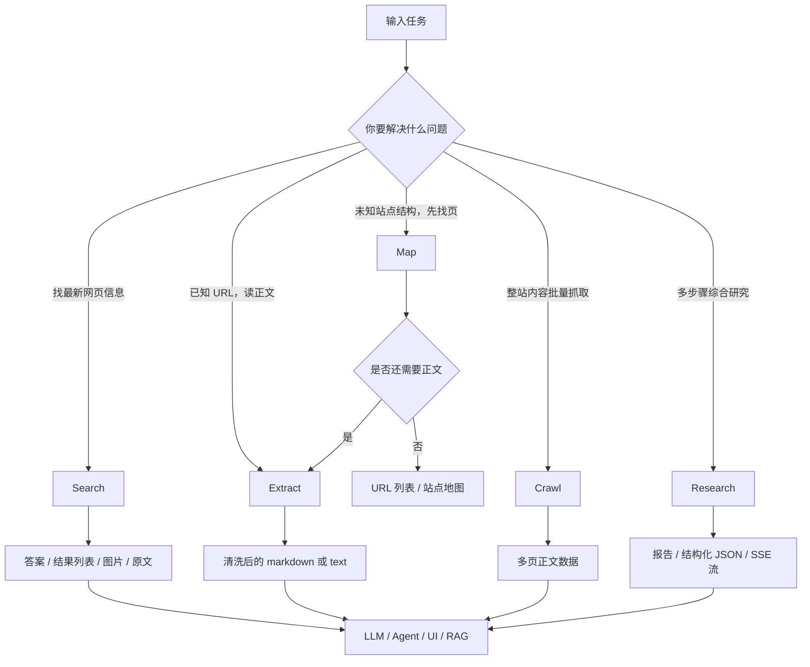

# Tavily 用法详细攻略与教程全景报告

## 执行摘要

这份报告基于 Tavily 官方文档站点的文档索引、核心 API 参考、SDK 参考、CLI、MCP、Agent Skills、Cookbook 教程和集成页整理而成。结论先说：**Tavily 的能力栈可以用一句话概括为“Search 找信息、Extract 读页面、Map 看结构、Crawl 扫站点、Research 出报告”，其外围再由 Python/JavaScript SDK、CLI、MCP Server、Agent Skills 和多种框架/无代码集成把这些能力嵌入不同开发环境。** 官方文档还明确给出了最佳实践：搜索要短、要拆分；站点处理优先 Map 再决定是否 Crawl；Research 要根据任务复杂度选择 `mini` / `pro`；API Key 必须服务端保管并按周期轮换。citeturn38view0turn25view0turn25view1turn25view2turn29view0turn27view0

连接器先行检查结果如下：**Gmail** 中找到了与 Tavily 相关的邮件 2 封，题目分别为 *Welcome to Tavily* 与 *Tavily API Usage Alert*；**Google Drive** 中检索到 4 个相关项，包含 `tavily-python-main.zip`、`tavily-python-main`、`README` 以及 `daily_topic_radar` 相关项。就标题和检索片段看，这些更像安装包、源码镜像或通用资料，而不是比官方文档更权威的用户自备说明稿，因此我将它们作为“辅证线索”，不作为本报告的主要事实依据。

另外，有两个实务上很重要的观察。第一，**文档本身存在少量跨页不一致**：例如 JavaScript Quickstart 页面正文里出现了 “With Tavily’s Python SDK” 这样的拷贝错误，且部分示例变量名在 Quickstart / SDK Reference 之间不完全一致；又如 Search 的深度和计费，在“价格页”和“Cookbook/CLI 页”之间存在表述差异，因此**生成代码时应以 Playground、OpenAPI、SDK Reference 和最新计费页交叉核验**。第二，**如果你的目标是工程落地而不是浏览文档，最稳的默认路径是：Search + Extract 解决单页事实检索，Map + Extract 解决站点定点抓取，Crawl 只在你明确需要“多页内容批量摄取”时再上，Research 则保留给真正需要多步骤综合判断的任务。** citeturn20view1turn19view2turn13view0turn30view0turn22view0turn38view0

## 目录

- 连接器扫描与官方文档地图
- 核心 API 与教程级用法详解
- SDK、CLI、MCP 与 Agent Skills
- 集成生态与平台对照
- 快速参考页
- 结论、建议与局限

## 连接器扫描与官方文档地图

### 连接器扫描结果

按你的要求，我先检查了已启用的连接器。结果是：Gmail 中有 2 封与 Tavily 相关的邮件；Google Drive 中有 4 个相关项。就命名看，Drive 里更像 Tavily Python SDK 源码包、README 或示例目录，并未显示出“你自己额外写的 Tavily 实战手册”这类内容，因此本报告仍然以官方文档为主轴，不把连接器内容当成规范来源。

### 官方文档全景与教程页清单

Tavily 官方建议在深入任何页面前，先读取 `llms.txt` 文档索引；Research、Research Get 和 Streaming 页面也重复强调了这一点。这个索引当前列出了核心 API 页面、最佳实践页、企业 Key 管理页、CLI、MCP、Agent Skills、双方 SDK 页面、Cookbook 教程、Agent Toolkit、Use Cases、Integrations、Partnerships 以及 OpenAPI 规格。换句话说，**`llms.txt` 就是 Tavily 文档站的机器可读目录，也是你自己写爬虫或知识整理器时最值得优先抓取的起点。** citeturn9view2turn10view0turn11view0turn38view0

官方索引中可明确识别的“教程/教程型页面”至少包括以下几类：

| 类别 | 页面 | 作用 |
|---|---|---|
| Cookbook 总入口 | Cookbook | 说明这些是可本地或 Colab 运行的 notebook 化教程。citeturn31view20 |
| Quick Tutorials | Web Search Essentials / Clean Content Extraction / Site Structure Discovery with Map / Website Crawling and Content Extraction / Product News Tracker / Deep Research with Streaming | 分别对应 Search / Extract / Map / Crawl / Search 场景化组合 / Research。citeturn37view1turn37view2 |
| Agent Toolkit | Chatbot / Company Intelligence / Hybrid Research / Social Media Research / Tools Reference / Agent Toolkit 概览 | 面向“研究型 agent” 的组合范式和工具编排。citeturn37view0turn37view1 |
| Use Cases | Chat / Company Research / Crawl to RAG / Data Enrichment / Market Researcher / Meeting Prep / RAG Evaluation | 面向真实业务应用。citeturn37view1turn37view2 |

从覆盖范围看，Tavily 文档并不是单纯“API 参考站”，而是一套**按抽象层分层的工程文档**：底层是 API/SDK，中层是最佳实践和 CLI/MCP，上层是 Cookbook、Agent Toolkit、Use Case 与 Integrations。对工程师来说，最有效的学习顺序通常不是从首页一页页读，而是：**Quickstart → 核心 API → Best Practices → SDK/CLI/MCP → 你打算接入的那个框架页。** citeturn14view0turn38view0turn25view0turn25view1turn25view2turn14view4turn14view5

### 一张图看懂 Tavily 的能力分工



这张图基本对应官方教程的实际分工：Search 用于事实检索与新闻监控，Extract 用于单页内容提纯，Map 用于发现 URL 结构，Crawl 用于批量站点摄取，Research 用于把“搜、抽、综合”包装成一个异步研究任务。citeturn38view0turn30view0turn32view4turn32view2turn32view3turn32view1

## 核心 API 与教程级用法详解

### Search

**定位。** Search 是 Tavily 的入口能力，用自然语言查询返回按相关性排序的网页结果，结果对象通常包含 `title`、`url`、`content`、`score`，可选返回 `answer`、`images`、`raw_content`、`favicon`、`published_date` 和 `request_id`。Cookbook 进一步把它定位为“实时信息检索、新闻监控、域名受限检索和多查询聚合”的基础工具。citeturn16view4turn15view3turn30view0

**前置条件。** 你至少需要一个 API Key。官方 Quickstart 给出免费额度为每月 1,000 credits；SDK 与 REST 都用 Bearer 认证；如果你希望按项目追踪成本，SDK 还支持 project_id / `TAVILY_PROJECT`。citeturn13view0turn14view0turn15view1turn12view3

**关键参数。**  
`query` 是唯一必填项。常用参数包括：`search_depth`、`topic`、`time_range` / `start_date` / `end_date`、`max_results`、`chunks_per_source`、`include_answer`、`include_raw_content`、`include_images`、`include_image_descriptions`、`include_domains`、`exclude_domains`、`country`、`exact_match`、`include_favicon`、`include_usage`。Best Practices 还强调 `auto_parameters` 会自动调参，但可能把深度提到更贵的模式，所以显式设置更可控。citeturn16view4turn15view3turn25view0

**最重要的几条方法论。**  
第一，查询尽量控制在 400 字符以内，并把复杂问题拆成 2–3 个子查询；第二，`exact_match` 只在必须命中精确短语时开启；第三，`include_raw_content` 不应该默认常开，生产里更常见的做法是先 Search 找 URL，再用 Extract 深读；第四，多个查询时优先异步并发。citeturn25view0

**可运行示例。** 下面给一个 JavaScript 版本。它同时演示新闻模式、时间窗口、图片和 AI 回答。参数名采用官方 JS SDK 的 camelCase 写法。citeturn18view2turn20view0

```ts
import { tavily } from "@tavily/core";

async function main() {
  const tvly = tavily({ apiKey: process.env.TAVILY_API_KEY! });

  const response = await tvly.search("AI regulation updates", {
    topic: "news",
    timeRange: "week",
    searchDepth: "advanced",
    maxResults: 5,
    includeAnswer: "advanced",
    includeImages: true,
    includeImageDescriptions: true,
    includeFavicon: true,
  });

  console.log("AI answer:\n", response.answer);
  for (const r of response.results) {
    console.log({
      title: r.title,
      url: r.url,
      score: r.score,
      publishedDate: r.publishedDate,
      favicon: r.favicon,
    });
  }
}

main().catch(console.error);
```

**输入、输出、预期结果与测试方法。**  
输入是一个自然语言查询和若干过滤器；输出里应至少有 `results` 和 `query`，启用回答后会多出 `answer`，启用图片后会多出顶层 `images` 与结果级 `images`；如果 `topic="news"`，你应能看到 `published_date` / `publishedDate` 类字段。测试时先用一个“今天/本周新闻”类问题，再手动把返回链接打开抽查 3–5 条，看相关性分数与时间窗口是否符合预期。citeturn16view4turn15view3turn30view0turn25view0

**常见错误与排查。**  
如果结果太少，先检查是否误用了 `exact_match`，再检查 include/exclude domain 是否过窄；如果费用异常，优先检查是否让 `auto_parameters` 自动升级了深度；如果延迟高但并不需要精确片段，把 `advanced` 降为 `basic` 或 `fast`；如果是合规或尽调场景，域名白名单优先于泛搜。citeturn25view0turn22view0

**性能、限制与兼容性注意。**  
`max_results` 的推荐范围是 1–20。官方价格页写明 Search 的定价是 `basic=1 credit`、`advanced=2 credits`；但 Cookbook/CLI 又出现了 `fast` 与 `ultra-fast` 的模式和额外计费描述。这个地方我建议你**把价格页当账单事实来源，把 Cookbook/CLI 当功能提示来源**，生成代码或预算前再以 Playground/OpenAPI 复核一次。citeturn13view0turn30view0turn22view0

### Extract

**定位。** Extract 用于“已知 URL 时的正文提纯”。它接收单个或一组 URL，返回清洗后的 Markdown 或纯文本，并可以在 `query + chunks_per_source` 条件下只返回与任务相关的片段。官方教程把它定义成“清洗正文、支持批量、支持 query-focused extraction”的内容提取工具。citeturn38view0turn32view4turn31view2

**前置条件。** API Key，且一次最多 20 个 URL。Extract 可以返回成功和失败两类结果；失败 URL 不会阻塞成功项返回。citeturn17view0turn19view0turn31view2

**关键参数。**  
`urls` 必填；`extract_depth` 决定提取层级，`basic` 更快，`advanced` 更适合 JS 渲染页面、表格和嵌入内容；`format` 支持 `markdown` 与 `text`；`include_images`、`include_favicon` 控制附加元数据；`query` 与 `chunks_per_source` 组合用于“定向抽取”；`include_usage` 可返回 credits，但未达到计数阈值时可能是 0。citeturn17view0turn28view0turn28view2

**最稳的工作流。**  
如果你只是快速原型，可直接在 Search 里打开 `include_raw_content`；如果你更在乎可控性，推荐流程是 **Search → relevance filtering → Extract**。Best Practices 甚至给出了一个完整的异步流程：先多子查询搜索，再按 score 过滤 URL，去重后并发 Extract。citeturn28view1turn28view3

**可运行示例。** 下面给一个 Python 版本，直接做“定向提取”。citeturn17view0turn28view0

```python
import os
from tavily import TavilyClient

client = TavilyClient(api_key=os.environ["TAVILY_API_KEY"])

response = client.extract(
    urls=[
        "https://docs.tavily.com/documentation/api-reference/endpoint/search",
        "https://docs.tavily.com/documentation/api-reference/endpoint/research",
    ],
    query="search_depth output_schema request_id",
    chunks_per_source=2,
    extract_depth="advanced",
    format="markdown",
    include_favicon=True,
    include_usage=True,
)

print("successful:", len(response["results"]))
print("failed:", len(response.get("failed_results", [])))
for item in response["results"]:
    print("\nURL:", item["url"])
    print(item["raw_content"][:400])
```

**输入、输出、预期结果与测试方法。**  
输入是 URL 列表和可选的定向查询；输出应包含 `results`、`failed_results`、`response_time`、`request_id`。如果传入了 `query`，你应该看到 `raw_content` 里是 `<chunk 1> [...] <chunk 2>` 形式的精简块，而不是整页全文。测试时先用一个短文档页，再用一个 JS 渲染较多的复杂页，比较 `basic` 与 `advanced` 的内容完整度和耗时。citeturn17view0turn28view0turn28view2

**常见错误与排查。**  
如果结果太长，优先上 `query + chunks_per_source`；如果复杂页面缺表格或缺正文，切到 `advanced`；如果批量里混入低质量链接，先在 Search 侧按 `score` 和域名过滤；如果对失败 URL 敏感，一定单独检查 `failed_results`，不要只看 `results`。citeturn28view0turn28view2turn28view3

**性能与成本。**  
官方计费页说明：`basic` 为每 5 个成功提取 1 credit，`advanced` 为每 5 个成功提取 2 credits，失败 URL 不计费。默认超时随层级变化，复杂页面更适合放宽超时预算。citeturn13view0turn17view0

### Map

**定位。** Map 返回站点 URL 结构，不做正文抽取。官方教程几乎把它当“先看地图再决定怎么抓”的前置步骤：用于站点发现、路径过滤、URL 采样，以及与 Extract 组合成“定点阅读”流程。citeturn38view0turn32view2turn33view0

**前置条件。** API Key 和一个起始 URL。典型参数包括深度、广度、总链接数限制、路径正则、域名正则、是否允许外链、指令式语义过滤和超时。citeturn8view0turn17view2

**关键参数。**  
`url` 必填；`max_depth`、`max_breadth`、`limit` 用于控制搜索范围；`select_paths` / `exclude_paths` / `select_domains` / `exclude_domains` 用于正则过滤；`allow_external` 控制是否包含外域链接；`instructions` 可以用自然语言要求只返回相关路径；`timeout` 为 10–150 秒。返回对象含 `base_url`、`results`、`response_time`、可选 `usage` 与 `request_id`。citeturn8view0turn8view7turn17view2

**可运行示例。** 下面这个 Python 示例是官方教程里最值得直接复用的模式：先只列出 API 与 SDK 页，再禁用外链。citeturn33view0

```python
import os
from tavily import TavilyClient

client = TavilyClient(api_key=os.environ["TAVILY_API_KEY"])

response = client.map(
    url="https://docs.tavily.com",
    select_paths=["/documentation/api-reference/.*", "/sdk/.*"],
    exclude_paths=["/changelog/.*"],
    max_depth=2,
    allow_external=False,
    include_usage=True,
)

print("base:", response["base_url"])
print("count:", len(response["results"]))
for url in response["results"][:20]:
    print(url)
```

**输入、输出、预期结果与测试方法。**  
输入是起始 URL 和过滤规则；输出是 URL 列表而不是正文。测试时最简单的办法是：先不加过滤跑一遍，确认有合理规模的 URL；再加 `select_paths`，看结果是否只剩 API/SDK 类链路；最后把这些 URL 抽样丢给 Extract，看是否确实命中了目标页面。citeturn32view2turn33view0

**最佳实践。**  
Map 的最大价值，不是“替代 Crawl”，而是**降低 Crawl 的浪费**。官方 Best Practices 明确建议：先用 Map 了解站点结构、识别路径模式、验证正则，再决定是否发起 Crawl。对于“只需要找某个说明页”的场景，Map + Extract 往往比 Crawl 更快、更便宜。citeturn28view5turn32view2turn33view0

**成本与限制。**  
价格页写的是：普通 Mapping 每 10 个成功页面 1 credit；带 `instructions` 的 Mapping 每 10 个成功页面 2 credits。与 Crawl 相比，它更便宜，因为不做正文提取。citeturn13view0turn32view2

### Crawl

**定位。** Crawl 是“Map + Extract 的整站化组合”，用于从一个根 URL 开始跟链，批量返回页面正文。它适合文档站镜像、离线知识库生成、RAG 入库、竞品网站巡检。官方文档把它定义为 graph-based traversal，支持并行路径探索、内建抽取和智能发现。citeturn38view0turn7view9turn32view3

**前置条件。** API Key 和一个起始站点。和 Map 类似，要先决定深度、广度、限制、路径正则；如果需要语义聚焦，要传 `instructions`；如果只想要片段而非整页，要再加 `chunks_per_source`。citeturn7view7turn17view1

**关键参数。**  
`url` 必填；`max_depth` / `max_breadth` / `limit` 控制遍历边界；`instructions` 做语义筛选；`select_paths` / `exclude_paths` / `select_domains` / `exclude_domains` 做正则边界；`allow_external` 决定是否发散到外域；`extract_depth` 决定抽取层级；`format` 决定 markdown/text；`include_images`、`include_favicon`、`include_usage` 可补充元数据。`instructions + chunks_per_source` 是站点抓取里很关键的组合。citeturn7view7turn7view5turn7view6turn17view1

**可运行示例。** 下面是一个“文档站入库”型例子。它和 Cookbook 的示例一致：先把路径限制到文档与 SDK，再启用 advanced extract。citeturn33view1

```python
import os
from tavily import TavilyClient

client = TavilyClient(api_key=os.environ["TAVILY_API_KEY"])

response = client.crawl(
    url="https://docs.tavily.com",
    max_depth=2,
    limit=50,
    select_paths=["/documentation/.*", "/sdk/.*"],
    exclude_paths=["/changelog/.*"],
    extract_depth="advanced",
    format="markdown",
    include_favicon=True,
    include_usage=True,
)

pages = response["results"]
print("crawled pages:", len(pages))
for page in pages[:5]:
    print(page["url"], len(page["raw_content"]))
```

**输入、输出、预期结果与测试方法。**  
输入是一个根 URL 与路径/语义边界；输出是多页结果，每项包含 `url` 和 `raw_content`。测试时要看三件事：命中的页是不是你真正要的页、`raw_content` 有没有成片废内容、以及抓取页数是否被 `max_depth` / `limit` 正确约束。对 RAG 场景，最好把每页字符数、失败页比率和去重率一起做日志。citeturn32view3turn28view4turn28view5

**常见错误与排查。**  
最大的坑是“深度过大却没有聚焦规则”。官方明确提醒 `max_depth=4` 以上可能指数级放大耗时，而且无 `instructions` 时容易上下文爆炸。默认建议是从 `max_depth=1`、`max_breadth=20` 这种保守参数起步。citeturn26view8turn26view6

**成本与限制。**  
Crawl 的账单由 Mapping 成本和 Extraction 成本相加。价格页给出的例子是：抓 10 页 + basic extract，总价约 3 credits；如果是 advanced extract，约 5 credits。这个端点还有单独速率限制：开发/生产 key 当前都为 100 RPM。citeturn13view0turn12view4

### Research

**定位。** Research 是 Tavily 的“高层封装端点”。它把多次搜索、来源分析、内容综合和最终报告生成包装成一个异步研究任务。你可以选择轮询取结果，也可以选择 SSE 流式消费；还可以要求输出普通报告或结构化 JSON。citeturn38view0turn9view5turn32view1turn11view0

**前置条件。** API Key；如果走 SDK，调用 `client.research()` 创建任务，`client.get_research()` 查询完成状态；如果是实时 UI，设置 `stream=true` 并按 SSE 消费。citeturn9view5turn10view0turn11view0

**关键参数。**  
`input` 必填；`model` 支持 `mini` / `pro` / `auto`；`stream` 控制是否返回 `text/event-stream`；`output_schema` 用 JSON Schema 约束结构化输出；`citation_format` 支持 `numbered`、`mla`、`apa`、`chicago`。完成态结果含 `content`、`sources`、`response_time`，其中 `content` 在有 schema 时可以是对象。citeturn9view5turn9view6turn10view3

**模型选择。**  
官方 Best Practices 的判断很直接：`pro` 适合跨多个子主题或多个领域的复杂研究；`mini` 适合边界清楚的问题；`auto` 适合你不确定复杂度的时候。Research 的计费是动态边界模型：`pro` 单次最低 15、最高 250 credits；`mini` 单次最低 4、最高 110 credits。citeturn29view0turn13view0

**可运行示例。** 先给一个最稳的轮询版本。citeturn32view1turn10view0

```python
import os
import time
from tavily import TavilyClient

client = TavilyClient(api_key=os.environ["TAVILY_API_KEY"])

task = client.research(
    input="What are the key trends in AI agents for 2026?",
    model="mini",
    citation_format="numbered",
)

print("task:", task["request_id"], task["status"])

while True:
    result = client.get_research(task["request_id"])
    if result["status"] == "completed":
        break
    if result["status"] == "failed":
        raise RuntimeError("Research task failed")
    time.sleep(5)

print(result["content"])
print("sources:", len(result["sources"]))
for s in result["sources"]:
    print("-", s["title"], s["url"])
```

如果你要做前端 UI、终端实时显示或长任务进度回显，流模式更合适。Tavily 的 SSE 格式兼容 OpenAI 风格的 `chat.completion.chunk`，会依次出现 `tool_calls`、`content`、`sources` 和 `event: done`。citeturn11view1turn11view4turn11view6turn33view2turn33view3

```ts
import { tavily } from "@tavily/core";

async function main() {
  const tvly = tavily({ apiKey: process.env.TAVILY_API_KEY! });

  const stream = await tvly.research("Research the latest developments in AI", {
    model: "pro",
    stream: true,
  });

  for await (const chunk of stream as AsyncGenerator<Buffer, void, unknown>) {
    console.log(chunk.toString("utf-8"));
  }
}

main().catch(console.error);
```

**输入、输出、预期结果与测试方法。**  
轮询模式的第一步输出应该是 `pending` 任务和 `request_id`；完成后应拿到 `content` 和 `sources`。流模式测试时，你应该能先看到工具阶段，再看到内容段流式输出，最后收到 sources 和 done 事件。若你传入 `output_schema`，则 `content` 应变成对象而不是 Markdown 字符串。citeturn9view5turn10view3turn11view4turn11view8

**最佳实践。**  
Research Prompt 不是“越长越好”，而是要目标清楚、上下文必要、已知事实提前交代、不要互相矛盾。结构化输出适合 enrichment 与 pipeline，报告适合阅读和展示；Streaming 适合 UI，Polling 适合后台任务。citeturn29view0turn28view7

### Usage、计费、速率限制与企业接口

**Usage。** `/usage` 可以同时返回 API key 维度与 account 维度的使用量，包括 search/extract/crawl/map/research 的分项 usage。这个接口还支持可选 `X-Project-ID`，用于按项目范围查询。citeturn12view0turn12view3

**速率限制。**  
当前文档显示：默认开发 key 100 RPM、生产 key 1,000 RPM；Crawl 独立限制为开发/生产各 100 RPM；Research 创建任务为开发/生产各 20 RPM；Usage 为每 10 分钟 10 次。超限返回 `429`，并携带 `retry-after` 头。citeturn12view4turn12view5turn12view9

**企业接口。**  
`llms.txt` 里列出了三类企业 Key 管理接口：Generate Keys、Deactivate Keys、Key Info。索引文字说明 Generate Keys 可批量生成并支持自定义配置，Deactivate Keys 可按 `request_id` 批量撤销或逐个撤销，Key Info 可按 Authorization header 查询某个 key 的信息。对于它们的详细请求体、字段、权限边界，我本次没有逐页深挖，因此这里严格标记为“**已在索引确认存在，但本次未做逐字段核验**”。citeturn38view0

## SDK、CLI、MCP 与 Agent Skills

### Python / JavaScript SDK

**Python SDK。**  
官方 Quickstart 与 Reference 表明，Python 侧有同步客户端 `TavilyClient` 和异步客户端 `AsyncTavilyClient`；支持 project tracking、proxy 配置，以及 Search / Extract / Crawl / Map 的原生调用。Python SDK Reference 还额外包含了一个 `TavilyHybridClient`，用于基于 MongoDB + 向量索引 + Cohere 的 Hybrid RAG，这一块是 JS 侧没有对等展开的。citeturn14view0turn15view0turn15view1turn15view2turn17view3

```python
from tavily import AsyncTavilyClient
import asyncio
import os

client = AsyncTavilyClient(os.environ["TAVILY_API_KEY"])

async def main():
    a, b = await asyncio.gather(
        client.search("latest AI trends"),
        client.search("future of quantum computing"),
    )
    print(len(a["results"]), len(b["results"]))

asyncio.run(main())
```

**JavaScript SDK。**  
官方 JS SDK 包名是 `@tavily/core`，客户端默认异步；同样支持 `projectId`、`proxies`、Search / Extract / Crawl / Map。需要注意的是，JS Quickstart 和 JS SDK Reference 存在少量拷贝错误和变量名不一致：例如 Quickstart 正文里把 JS SDK 写成了 Python SDK；某些片段里实例名是 `tvly`，调用时却写成 `client.map()`。真正写生产代码时，应以包名、函数签名和 Playground/OpenAPI 为准。citeturn20view0turn20view1turn19view2

```ts
import { tavily } from "@tavily/core";

const client = tavily({
  apiKey: process.env.TAVILY_API_KEY!,
  projectId: "demo-project",
});

const response = await client.map("https://docs.tavily.com", {
  instructions: "Find all pages on the Python SDK",
  allowExternal: false,
});

console.log(response.results);
```

### CLI

CLI 是 Tavily 文档里少见的“工程落地效率神器”。安装方式有三种：官方 installer 脚本、`uv tool install tavily-cli` 或 `pip install tavily-cli`；认证方式有 API key 登录、浏览器 OAuth 和环境变量。CLI 覆盖 Search / Extract / Crawl / Map / Research 五大能力，并支持 REPL、JSON 输出、文件输出和研究轮询。citeturn21view0turn21view1turn22view0turn22view3

```bash
# 安装
curl -fsSL https://cli.tavily.com/install.sh | bash
tvly login --api-key tvly-YOUR_API_KEY

# 搜索
tvly search "AI regulation" --topic news --time-range week --json

# 抽取
tvly extract https://docs.python.org/3/tutorial/ --query "list comprehensions" --chunks-per-source 3 --json

# 绘制站点图
tvly map https://docs.tavily.com --select-paths "/api/.*" --json

# 深度研究
tvly research "comparison of React vs Vue in 2025" --model pro --stream
```

**预期结果与测试方法。**  
`--json` 模式下，stdout 应该是可直接管道给 `jq` 或脚本的纯 JSON；人类可读输出写到 stderr。若只测试安装与鉴权，用 `tvly --version`、`tvly --status` 和 `tvly auth` 就够了。CLI 还明确给出了退出码：0 成功，2 参数错误，3 鉴权错误，4 API 错误。citeturn21view2turn21view8turn21view9

### MCP Server

Tavily MCP Server 的作用，是把 Tavily 作为 MCP 工具暴露给宿主 AI 客户端。官方文档确认它至少提供 `tavily-search` 和 `tavily-extract`；在 OpenAI Agent Builder、Google ADK 等页面里，则还能看到 `tavily_map` 与 `tavily_crawl` 被直接作为可选工具列出。换句话说，**MCP 是 Tavily 接入上层 Agent 宿主的“统一控制面”**。citeturn23view2turn23view3turn34view0turn35view0

最常见的远程接法是：

```json
{
  "mcpServers": {
    "tavily-remote-mcp": {
      "command": "npx -y mcp-remote https://mcp.tavily.com/mcp/?tavilyApiKey=<your-api-key>",
      "env": {}
    }
  }
}
```

如果是 OpenAI 的 MCP tool 形态，文档给了这种写法，并支持通过 `DEFAULT_PARAMETERS` 头统一注入默认搜索参数：citeturn23view4turn23view3

```python
import json
from openai import OpenAI

client = OpenAI()

resp = client.responses.create(
    model="gpt-4.1",
    tools=[
        {
            "type": "mcp",
            "server_label": "tavily",
            "server_url": "https://mcp.tavily.com/mcp/?tavilyApiKey=<your-api-key>",
            "require_approval": "never",
            "headers": {
                "DEFAULT_PARAMETERS": json.dumps({
                    "include_favicon": True,
                    "include_images": False,
                    "include_raw_content": False
                })
            }
        }
    ],
    input="Do you have access to the Tavily MCP server?"
)
```

**安全与排障。**  
MCP 页里最值得注意的不是功能，而是运维细节：Node.js 版本、`npx` 路径、配置 JSON 语法、API key 存储位置，以及不能原生支持 remote MCP 的客户端需要 `mcp-remote` 桥接。citeturn23view0turn23view1turn23view5

### Agent Skills

Agent Skills 是官方给 Claude Code、Cursor、Cline、Codex、Windsurf 等“AI coding agent”准备的一层技能封装。它基于 Tavily CLI 提供了 `tavily-search`、`tavily-extract`、`tavily-crawl`、`tavily-map`、`tavily-research` 和 `tavily-best-practices` 六个技能。安装方式非常简单：先安装 CLI，再执行 `npx skills add tavily-ai/skills --all`。citeturn24view2

```bash
curl -fsSL https://cli.tavily.com/install.sh | bash
npx skills add tavily-ai/skills --all

# 安装后可直接在 agent 中用 slash command
/tavily-search current React best practices
/tavily-crawl https://docs.example.com
/tavily-research AI agent frameworks and save to report.json
```

这套机制特别适合“你不想手写 tool schema，但又想让编码代理自然调 Tavily”的场景。它本质上不是新 API，而是把 CLI 的调用范式预包装成 agent 可直接调度的技能层。citeturn24view2

## 集成生态与平台对照

### 集成方法论

从官方索引看，Tavily 的集成生态大体分成四种接入模式：

| 接入模式 | 典型页面 | 本质 | 最适合谁 |
|---|---|---|---|
| 原生 SDK / function calling | entity["company","OpenAI","ai company"]、entity["company","Anthropic","ai company"]、entity["organization","LangChain","framework company"]、entity["organization","LlamaIndex","rag framework"]、entity["organization","CrewAI","agent framework"]、entity["company","Vercel","cloud company"]、entity["organization","Mastra","typescript framework"]、entity["organization","Pydantic AI","python framework"]、entity["organization","Agno","agent framework"] | 你自己定义工具签名、执行 Tavily 请求、回填给模型 | 想要完全控制工具编排的工程师 |
| MCP 接入 | OpenAI Agent Builder、Claude Connectors、Google ADK、Amazon Bedrock AgentCore、Microsoft Azure、Databricks | 宿主平台通过 Tavily MCP 暴露搜索/抽取/映射/抓取能力 | 想最快把 Tavily 嵌入某个 agent 宿主 |
| 无代码 / 低代码 | n8n、Make、Zapier、Tines、StackAI、Dify、FlowiseAI、Langflow | 通过节点、App、Tool 或 Workflow UI 调 Tavily | 自动化运营、业务流程编排 |
| 官方伙伴 / 原生平台应用 | Databricks、IBM watsonx Orchestrate、Snowflake | 走平台市场、原生连接或平台托管形态 | 企业平台团队 |

这个分类不是我主观划分，而是从官方索引和已核验页面反推出来的：有些页面明确写“通过 Tavily MCP Server 接入”，有些写“no-code integration”，有些则是 framework package 或 function calling 例子。citeturn38view0turn34view0turn35view0turn36view0

### 全量集成清单

下表按官方 `llms.txt` 索引罗列当前公开集成/伙伴页。**如果某页在我本次已核验范围内没有明确写出工具覆盖面，我会标“文档未说明”。** 这样做是为了不替官方补写不存在的功能承诺。citeturn38view0

| 集成/伙伴 | 接入形态 | 文档可确认的能力范围 | 最小接入方式 | 备注 |
|---|---|---|---|---|
| OpenAI Agent Builder | MCP | Search / Extract / Map / Crawl | 在 Agent Builder 工具页填入 Tavily MCP URL | 页面最完整之一。citeturn34view0 |
| Agno | 原生 framework 集成 | 文档已确认集成；覆盖面未在已核验片段中展开 | 安装依赖、设置 API key、初始化 agent | 适合 Python agent。citeturn34view1turn38view0 |
| Anthropic | function calling | Search；页面说明底部还有 Search/Extract/Map/Crawl 的 schema | 定义 `tavily_search` 工具并在 `tool_use` 后执行 | 典型“两步工具调用”模式。citeturn40view3turn40view4 |
| Arcade.dev | MCP Gateway | Search / Extract / Crawl / Map / Research | 通过 Arcade MCP Gateway 接入 | 官方索引明确写全覆盖。citeturn38view0 |
| Cartesia | 语音 agent SDK | 搜索与抽取 | 走 Line SDK + Tavily | 适合 voice agent。citeturn38view0 |
| Claude Connectors | Claude 官方 Connector | Search / Extract / Crawl / Research | 作为 Claude Connector 启用 | 页面索引写明支持范围。citeturn38view0 |
| Composio | tool 集成 | 文档未说明具体覆盖面 | 通过 Composio 添加 Tavily | 适合多工具编排。citeturn38view0 |
| CrewAI | agent framework | Search 至少明确；更多能力待页内确认 | 在 CrewAI agent 中注册 Tavily tool | 适合多 agent 协作。citeturn38view0 |
| Dify | 无代码 | no-code 集成 | 在 Dify 中添加 Tavily 工具/插件 | 覆盖面以页面为准。citeturn38view0 |
| FlowiseAI | 可视化编排 | 文档未说明具体覆盖面 | 在 Flowise 中添加 Tavily | 适合 RAG / flow 编排。citeturn38view0 |
| Google ADK | MCP | Search / Extract / Map / Crawl | `pip install google-adk mcp` 后接 `https://mcp.tavily.com/mcp/` | 还给了 CLI 与 Web 运行方式。citeturn35view0 |
| LangChain | 原生 tool package | Search | `pip install -U langchain-tavily`，用 `TavilySearch` | 适合和 LangGraph / agent 一起用。citeturn40view8turn40view9 |
| Langflow | 可视化框架 | 文档未说明具体覆盖面 | 通过图形界面加入 Tavily 节点 | 偏低代码。citeturn38view0 |
| LlamaIndex | framework 集成 | Web search | 在 LlamaIndex 中调用 Tavily | 索引里明确是“Search the web”。citeturn38view0 |
| Make | 无代码 | no-code 集成 | 作为 Make 模块/HTTP 动作接入 | 偏业务自动化。citeturn38view0 |
| Mastra | 原生 package | Search / Extract / Crawl / Map | 使用 native package 形式接入 | 适合 TypeScript agent。citeturn38view0 |
| n8n | 无代码 | no-code 集成 | 作为 n8n 节点/HTTP tool 使用 | 常见自动化管道。citeturn38view0 |
| OpenAI | 原生 function calling / Agents SDK / Responses API | Search 明确；页面还给了更多 endpoint schema | 直接定义工具函数或 tool schema | 代码示例最丰富。citeturn39view5turn39view4turn39view7 |
| OpenClaw | messaging agent | Search / Extract | 给 WhatsApp / Telegram / Discord / iMessage 等 agent 加实时网页能力 | 适合消息渠道机器人。citeturn38view0 |
| Pydantic AI | Python agent framework | 文档未说明具体覆盖面 | 通过 Pydantic AI tool 接入 | 偏 Python 生态。citeturn38view0 |
| StackAI | 无代码 / agent workflow | Search / Extract / Crawl / Map | 在 StackAI 中作为 Node/Tool 添加 | 页面给了完整参数配置说明。citeturn36view0 |
| Tines | 无代码工作流 | 自动化 intelligence workflow | 通过 Tines 工作流调用 Tavily | 偏安全/自动化团队。citeturn36view1turn38view0 |
| Vercel AI SDK | TypeScript / AI SDK | Search / Extract / Crawl / Map | 在 AI SDK tool 中包装 Tavily | 前端 AI 应用常用。citeturn38view0 |
| Zapier | 无代码 | no-code 集成 | 作为 Zap/Action 使用 | 覆盖面以页面为准。citeturn38view0 |
| Amazon Bedrock AgentCore | MCP | 文档确认 Tavily MCP + AWS Agent 部署 | 通过 Tavily MCP 接到 AgentCore | 偏 AWS 企业代理部署。citeturn38view0 |
| Microsoft Azure | MCP | Tavily Remote MCP + Azure AI Foundry / MCP Center | 通过 Remote MCP 接入 Azure agent | 偏企业级托管 agent。citeturn38view0 |
| Databricks | MCP / RAG | 实时搜索与 RAG | 在 Databricks 中接 Tavily MCP | 偏数据平台团队。citeturn38view0 |
| IBM watsonx Orchestrate | 伙伴集成 | AI-powered research | 通过 watsonx Orchestrate 集成 | 以研究类工作流为主。citeturn38view0 |
| Snowflake | 原生市场应用 | Native app on marketplace | 在 Snowflake Marketplace 获取 | 更像平台分发形态。citeturn38view0 |

**怎么选。**  
如果你是工程师，最优先考虑的其实只有三条路：  
其一，自己用 SDK / function calling，控制力最高；  
其二，宿主支持 MCP，就尽量走 MCP，接入最省；  
其三，如果只是做运营自动化或 PoC，直接走 n8n / Make / Zapier / StackAI 这类无代码平台。这个判断来自已核验页面的接入复杂度、示例完整度和参数显式程度。citeturn34view0turn35view0turn36view0turn39view5turn40view8

## 快速参考页

### 功能对照表

| 功能 | 典型用途 | 主接口/命令 | 关键参数 | 返回重点 | 代表教程 |
|---|---|---|---|---|---|
| Search | 实时搜索、新闻、域名约束检索 | `/search`、`client.search()`、`tvly search` | `query`、`search_depth`、`topic`、`time_range`、`max_results`、`include_answer` | `results`、`answer`、`images`、`score`、`request_id` | Web Search Essentials。citeturn30view0turn22view0turn15view3 |
| Extract | 已知 URL 的正文抽取 | `/extract`、`client.extract()`、`tvly extract` | `urls`、`extract_depth`、`format`、`query`、`chunks_per_source` | `results`、`failed_results`、`raw_content` | Clean Content Extraction。citeturn32view4turn17view0turn22view1 |
| Map | URL 发现、站点结构摸底 | `/map`、`client.map()`、`tvly map` | `url`、`select_paths`、`exclude_paths`、`instructions`、`allow_external` | `results` URL 列表 | Site Structure Discovery with Map。citeturn32view2turn17view2turn22view3 |
| Crawl | 多页抓取、文档站入库、RAG | `/crawl`、`client.crawl()`、`tvly crawl` | `url`、`max_depth`、`limit`、`instructions`、`extract_depth` | 多页 `raw_content` | Website Crawling and Content Extraction。citeturn32view3turn17view1turn22view2 |
| Research | 多步骤综合研究、报告生成 | `/research` + `/research/{id}`、`client.research()`、`tvly research` | `input`、`model`、`stream`、`output_schema`、`citation_format` | `content`、`sources`、SSE 流 | Deep Research with Streaming。citeturn32view1turn33view2turn22view3 |
| Usage | 成本/配额观测 | `/usage` | `X-Project-ID` | key/account usage | Usage。citeturn12view0turn12view3 |
| CLI | 终端调试与自动化 | `tvly ...` | `--json`、`-o`、`--status` | stdout 纯 JSON / exit codes | Tavily CLI。citeturn21view2turn21view8turn21view9 |
| MCP | 宿主 agent 集成 | Tavily MCP Server | MCP URL、`Authorization` / `DEFAULT_PARAMETERS` | 宿主内工具调用 | MCP / Agent Builder / Google ADK。citeturn23view2turn23view3turn34view0turn35view0 |

### 速查清单

| 你现在的任务 | 默认先用什么 | 什么时候升级 |
|---|---|---|
| 问一个当前事实 | Search | 需要整页证据时再加 Extract。citeturn30view0turn28view1 |
| 你已经知道 URL | Extract | 页面复杂、有表格/JS 再切 `advanced`。citeturn32view4turn28view2 |
| 你不知道站点里哪一页有答案 | Map | 找到路径后再 Extract；只有需要大量页面正文才用 Crawl。citeturn32view2turn28view5 |
| 你要把文档站喂给 RAG | Crawl | 先 Map 验证路径模式更稳。citeturn33view1turn28view5 |
| 你要出一篇多来源带引用的研究稿 | Research mini | 主题跨多个维度或需要广谱分析时升到 `pro`。citeturn29view0turn13view0 |
| 你在做本地调试或 shell 自动化 | CLI | 稳定后再迁 SDK / MCP。citeturn22view0turn22view3 |
| 你要把 Tavily 接入现成 agent 宿主 | MCP | 宿主不支持 MCP 时用原生 function calling。citeturn23view2turn34view0turn39view5 |

## 结论、建议与局限

**结论。**  
如果只保留一句工程判断：**Tavily 不是“一个搜索 API”，而是一套围绕“实时网页能力”分层设计的工具体系。** Search 是粗粒度发现，Extract 是精读，Map 是站点结构探测，Crawl 是批量页面摄取，Research 是把这些步骤再封装成异步研究任务；SDK、CLI、MCP 和 Agent Skills 是它的四种不同交付面。这个分层是清晰的，也是整个文档站最稳定的主线。citeturn38view0turn14view0turn14view4turn14view5turn24view2

**建议。**  
如果你准备真正落地，我建议采用下面这套默认架构。对业务接口层：单问答走 Search；已知 URL 走 Extract；站点摄取先 Map 再决定是否 Crawl；研究报告走 Research。对开发体验层：本地开发先 CLI，生产服务用 SDK，外部 agent 宿主优先走 MCP。对成本层：Research 只在确实需要跨来源综合判断时用；其余场景尽量用 Search/Extract/Map 组合。对风险层：API key 永远放服务端或 secrets manager；研究和抓取任务做好 `retry-after`、超时和状态轮询。citeturn25view0turn25view1turn25view2turn27view0turn12view9

**开放问题与局限。**  
有三点需要你在实装时自己继续留意。其一，JavaScript Quickstart / 部分 SDK 页面存在轻微示例拷贝或变量名不一致，代码生成前请再过一遍 Playground 或 OpenAPI。其二，Search 深度与价格在价格页和 Cookbook/CLI 页之间有演进式表述差异，账单解释应以价格页和实时控制台为准。其三，企业 Key 管理接口在官方索引里存在，但我本次没有逐页展开其字段与权限模型，因此在企业租户治理场景里，还需要单独补查这三页。citeturn20view1turn19view2turn13view0turn30view0turn38view0

【钉子一：Map 先行、再决定 Crawl】→ 执行链上最脆弱的断裂点，是一开始就整站 Crawl，结果把无关页面、无关路径和外链内容一起吞进去，最后让成本、延迟和上下文长度同时失控。  
【钉子二：Research 只给复杂问题】→ 隐藏的机会成本，是把本可用 Search + Extract 解决的问题都升级成 Research，造成 credits 浪费、异步复杂度提升，以及产品响应时间变长。  
【钉子三：Tavily 是分层能力栈，不是单一搜索接口】→ 剥离所有工具后的致命前提，是你必须先把任务类型判断对；一旦把“找页、读页、扫站、写报告”混成一类，任何接口都会被你用得又贵又慢又不稳。