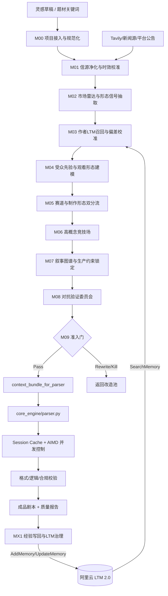
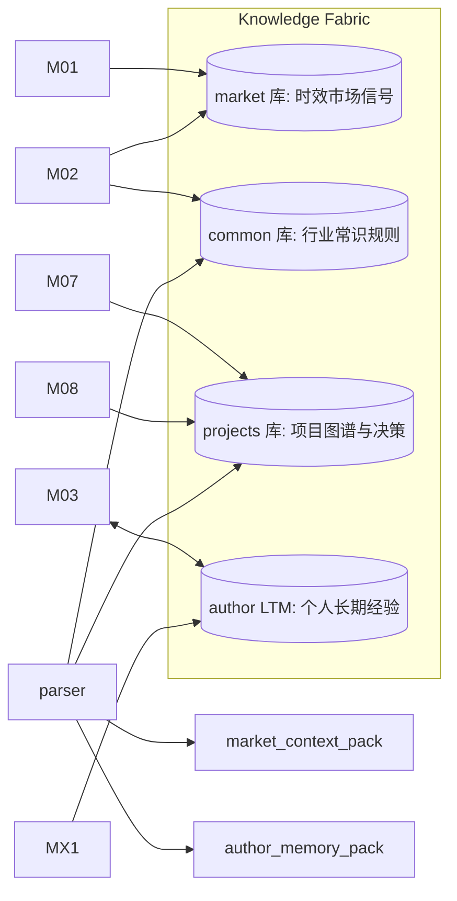
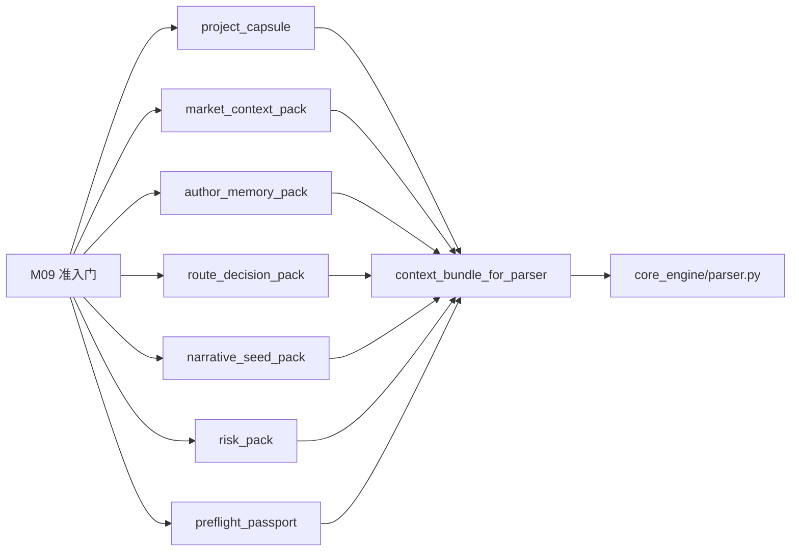

# README 融合改造图（V4.1）

你现在 README 的硬伤就一句：**只有“生产线”，没有“准入中台”** 。  
下面给你可直接粘贴的 **README 融合改造图（V4.1）** 。

---

## 🧩 融合架构总图（前置中台 + 工业流水线 + LTM闭环）



---

## 🧠 知识层融合图（三库一脑）



---

## 📦 数据包交接图（准入后喂生产线）



---

## 🏗️ 目录融合改造图（README Architecture 替换版）

```text
.
├── pre_hub/                    # 前置中台（立项/分流/准入）
│   ├── intake.py               # M00
│   ├── source_guard.py         # M01
│   ├── market_radar.py         # M02
│   ├── author_memory.py        # M03
│   ├── prior_lab.py            # M04
│   ├── router.py               # M05
│   ├── concept_arena.py        # M06
│   ├── graph_seed.py           # M07
│   ├── adversarial_gate.py     # M08
│   ├── admission_gate.py       # M09
│   └── feedback_loop.py        # MX1
├── core_engine/                # 生产引擎（扩写/缓存/校验）
├── rag_engine/
│   ├── market_ingest.py
│   ├── source_cleaner.py
│   ├── market_analyzer.py
│   ├── ltm_bridge.py
│   ├── ltm_shadow_store.py
│   └── project_kb_manager.py
├── knowledge_base/
│   ├── market/
│   ├── common/
│   └── projects/
├── drafts/                     # 原始草稿输入
├── scripts_output/             # 成品剧本输出
├── reports/
│   ├── preflight/
│   ├── quality/
│   └── postmortem/
├── scripts/
│   ├── run_preflight.py
│   ├── run_pipeline.py
│   └── review_writeback.py
├── schemas/                    # Pydantic模型
├── config.yaml
└── 启动器.bat
```

---

## 🎛️ 控制台融合改造图（菜单升级）

|新编号|模块|作用|
| -------: | -----------------------------| ----------------------------------|
|[1]|🚀 一键全流程|前置中台 + 生产流水线一体执行|
|[2]|🧠 前置准入（Preflight）|立项、分流、竞技、准入护照|
|[3]|✍️ 生产流水线（Pipeline）|仅处理已通过准入项目|
|[4]|🛰️ 市场雷达|时效抓取、净化、趋势抽取|
|[5]|🌾 知识导入|写入 market/common/projects 三库|
|[6]|🧠 LTM召回诊断|检查作者记忆注入质量|
|[7]|♻️ 经验写回|复盘后写入 LTM（Add/Update）|
|[8]|🧪 质量与合规模拟|对抗验证、风险包生成|
|[9]|📊 统计看板|产量、成本、质量、命中率|
|[10]|🧹 缓存与快照维护|​`.cache/`、影子库、回滚点维护|

---

你把这几段塞进 README，对外讲清楚的就不再是“我会扩写”，而是：  
 **“我有立项中台、准入门、生产线、LTM成长闭环的一体化系统。”**   
这才是 2026 的版本。
